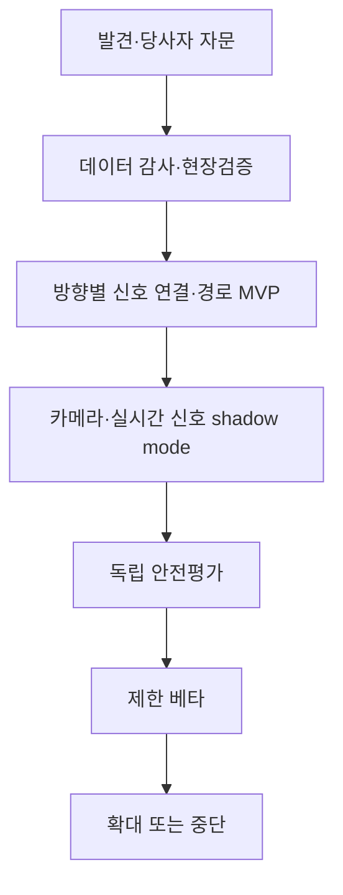

# 구현 계획 — 신입 개발자용 단계별 절차

> 제안 기간: 16주 MVP + 안전 검증 기간  
> 팀 규모 가정: 6~9명  
> 기준일: 2026-09-04
> 계획 버전: 0.2 — 실시간 신호·횡단보도 문맥 융합

기간은 인원보다 현장 협의·데이터 품질·안전 검증에 더 크게 좌우된다. 통과 조건을 만족하지 못하면 다음 단계로 넘어가지 않는다.

## 0. 전체 단계



## 1. 1~2주 — 문제 발견과 안전 범위

### 해야 할 일

1. 제품책임자, Android, 백엔드/데이터, ML, QA 담당을 지정한다.
2. 시각장애인 당사자 자문단과 보행훈련 전문가를 모집한다.
3. 인터뷰 동의서, 개인정보 안내, 보상, 접근 가능한 인터뷰 방식을 준비한다.
4. 기존 보행 방식, 음향신호기 사용, 스마트폰 보유 위치, 한 손 조작을 관찰한다.
5. “앱이 해서는 안 되는 안내”를 워크숍에서 확정한다.
6. 광주 파일럿 후보 생활권과 안전요원 동선, 촬영 가능성을 정한다.
7. 위험등록부를 만들고 false-green을 최상위 위험으로 둔다.
8. 한국도로교통공단·광주 담당기관에 실시간 보행신호 제공 범위, 계약, 시험 접근을 문의한다.

### 산출물

- 검증된 persona와 journey
- 안전 UX 문구 목록
- 20~30개 후보 횡단보도
- 위험등록부 v1
- 법률 검토 질문 목록
- 공식 실시간 신호정보 기관 문의서와 답변 추적표

### 통과 조건

- 당사자 최소 5명이 핵심 여정과 금지 문구를 검토
- 카메라 AI가 보조 기능이라는 합의
- 현장 시험의 안전 담당자와 중단 기준 확정

## 2. 2~4주 — 공공데이터 감사와 현장검증

### 해야 할 일

1. 전국신호등·전국횡단보도 CSV를 내려받고 SHA-256을 기록한다.
2. raw/staging/canonical/published 계층을 만든다.
3. 열 매핑, Y/N/null, 날짜, 좌표 parser를 테스트 우선으로 구현한다.
4. 광주 행정구역 레코드를 명칭과 공간경계 두 방식으로 추출한다.
5. 신호등↔횡단보도 10/20/30m 공간조인 후보를 만든다.
6. 자동 병합 없이 모호 후보를 지도와 표로 내보낸다.
7. 현장 조사표를 만들고 2인 1조로 20~30개를 점검한다.
8. 횡단 방향 bearing, 시작점, 음향신호기 버튼 방향, 점자블록, 턱낮춤, 데이터 일치 여부를 기록한다.
9. 횡단 방향마다 끝점과 연결된 보행신호 ID·예상 화면 위치를 기록한다.
10. 공식 공급자의 intersection/movement 코드가 있으면 현장 방향과 연결하되 자동 승인하지 않는다.
11. 도색 훼손·가림·대각선·점선형 등 횡단보도 인식 난이도를 태깅한다.

### 현장 조사 안전 규칙

- 사용자 시험이 아니라 시설 조사부터 수행한다.
- 차도 안에서 촬영하거나 스마트폰 화면을 보며 이동하지 않는다.
- 카메라 담당과 주변 안전 담당을 분리한다.
- 비·눈·야간은 별도 위험평가 후 수행한다.
- 얼굴·번호판을 불필요하게 수집하지 않는다.

### 통과 조건

- 원천 파일에서 published 데이터까지 재현 가능한 명령 1개
- 모든 published 레코드에 출처·기준일·검증상태 존재
- 파일럿 20개 이상 현장 확인
- 모호한 횡단 방향은 published AI 대상에서 제외
- 모든 AI 대상에 검수된 방향별 `crossing_signal_link` 존재

## 3. 3~6주 — 백엔드와 공간 API

### 해야 할 일

1. Docker Compose에 PostgreSQL/PostGIS와 FastAPI를 구성한다.
2. Alembic으로 source/raw/crossing/verification/report 테이블을 만든다.
3. `/health`, `/v1/crossings/nearby`, `/v1/crossings/corridor`를 구현한다.
4. 반경, 대한민국 범위, 최대 radius, pagination을 검증한다.
5. 좌표와 목적지를 access log에서 제거한다.
6. TMAP 어댑터와 fake router를 구현한다.
7. 공급자 오류·timeout·quota를 내부 오류 코드로 매핑한다.
8. OpenAPI schema와 contract test를 생성한다.
9. 공급자 독립적인 `SignalStatusProvider` 계약과 fake provider를 구현한다.
10. 승인된 시험 접근이 확보된 경우에만 광주 실시간 신호 어댑터를 추가한다.
11. 신호 상태, 원천 생성시각, 수신시각, 교차로·이동방향 코드와 품질 플래그를 정규화한다.

### 통과 조건

- 100m 반경 공간조회 P95 목표 충족
- SQL injection, 과도한 radius, 잘못된 좌표 테스트 통과
- APK/프런트 코드에 TMAP 키 없음
- 공급자 장애 시 retry 폭주 없음
- 실시간 신호 미지원·권한거부·stale·방향미매핑이 GREEN으로 변환되지 않음

## 4. 4~8주 — Android 경로·접근성 MVP

### 해야 할 일

1. Kotlin/Compose 멀티모듈 프로젝트를 만든다.
2. 온보딩, 목적지, 경로 요약, 내비게이션, 설정 화면을 만든다.
3. 위치 권한을 기능 시점에 요청한다.
4. TMAP 보행자 경로 API(`searchOption="30"`, 계단제외) 연동 및 `DisclaimerBanner`(안전 고지 배너) 사용자 확인을 구현한다.
5. 4단계 보행 상태 머신(`WalkingMode`: `IDLE`, `WALKING`, `APPROACHING_CROSSING`, `CROSSING`)을 구현한다.
6. 실시간 GPS 신호 품질(%) 및 정확도 반경(±m) 상태 배지와 TalkBack 낭독을 구현한다.
7. `NavigationForegroundService`를 통해 화면 잠금 상태에서도 백그라운드 위치 추적 및 영구 알림(Foreground Notification, 1-Tap 즉시 정지)을 구현한다.
8. 방향 분기점 도달 시 즉시 음성 안내(`QUEUE_FLUSH` 우선순위) 및 30m/15m 전방 접근 사전 안내 큐를 구현한다.
9. 저시력자를 위한 고대비 대형 방향 표시기(`LowVisionDirectionIndicator`: 80dp+ 심볼, 36sp+ 거리, 4dp 황색 테두리 `#FFD600`, 200% 폰트 스케일링)를 구현한다.
10. 경로 선 투영, 진행도, 이탈·재탐색을 구현한다.
11. 주변 시설을 Room에 캐시하고 접근 알림을 구현한다.
12. TTS 우선순위 큐, 다시 듣기, 중지, 4대 진동 어휘 체계(`DANGER_STOP`, `CAUTION_APPROACH`, `CONFIRM_TURN`, `ORIENTATION_ALIGNED`)를 구현한다.
13. 시각장애인 특화 음성 길안내 포맷터(`BlindGuidanceFormatter.kt`)를 구현한다:
    - 1~12시 시계 방향(Clock Face) 상대 각도 및 성인 평균 보폭(0.65m) 기준 걸음 수 환산 병기.
    - TMAP 상호명/출구 등 시각 랜드마크 필터링 및 능동적 신체 회전각 안내.
14. 지자기 회전 센서(`Sensor.TYPE_ROTATION_VECTOR`) 기반 실시간 방위각 추적 및 경로 정대(Orientation Alignment) 분석을 구현한다:
    - 진행 방향 정대(±18° 이내) 시 음성("올바른 진행 방향입니다. 전방을 주의하며 걸으세요.") 및 햅틱 콤파스 피드백(60ms-60ms-60ms 2회 진동, 6초 쿨다운).
15. 횡단보도 접근 시(`APPROACHING_CROSSING` 15m/8m) 카메라 보조 화면 자동 전환 이벤트(`TriggerCrossingAssist`)를 구현한다.
16. 실시간 경로 정대 고대비 상태 카드(🟢 정대 완료 / 🧭 회전 필요) 및 LiveRegion 접근성을 적용한다.
17. 모든 화면에 Compose semantics와 48/64dp 영역을 적용한다.
18. TalkBack을 켜고 화면을 보지 않은 채 E2E 시험한다.

### 통과 조건

- 카메라 기능 없이도 목적지→경로→시설 알림→종료 가능
- 위치 권한 거부·대략 위치·GPS OFF에서 안전한 축소
- 방향 전환 시 음성 지연 0초(QUEUE_FLUSH) 및 저시력자 방향 지시 표시 확인
- 시계 방향 및 걸음 수 음성 안내 정확성, 지자기 햅틱 콤파스 작동 확인
- 횡단보도 15m 접근 시 화면 터치 없는 카메라 보조 화면 자동 전환 확인
- 글꼴 200%, TalkBack, 한 손 조작 시 P0 흐름 통과
- 30분 내비게이션의 배터리·발열 기준선 기록

## 5. 5~10주 — ML 데이터와 오프라인 모델

### 해야 할 일

1. AI Hub 데이터 설명서·라이선스·라벨을 검토한다.
2. 차량 시점 자료를 pretraining 후보로만 사용한다.
3. 파일럿 교차로에서 스마트폰 보행자 시점 데이터를 별도 동의로 수집한다.
4. 장소 단위로 train/validation/test를 분리한다.
5. 보행 신호, 차량 신호, 자전거 신호, 광고 LED, 반사광을 라벨링한다.
6. 횡단보도 mask, 시작점, 진행방향과 목표 보행신호 연결을 라벨링한다.
7. crosswalk segmentation + signal detector/classifier + associator의 단계형 구조와 multi-task 후보를 비교한다.
8. 같은 신호 track의 RED→GREEN 변화와 box 교체 사례를 시퀀스로 구축한다.
9. INT8 양자화 전후 false-green과 latency를 비교한다.
10. LiteRT로 변환하고 CPU/GPU/NPU 기기 벤치마크를 한다.
11. model card와 evaluation report를 작성한다.

### 통과 조건

- 학습 데이터와 test 장소가 겹치지 않음
- test set이 적색·점멸·모호·hard negative를 충분히 포함
- 전체 정확도 외 false-green event 지표 보고
- 횡단보도 IoU·방향오차·목표 신호 오선택 지표 보고
- 저·중·고성능 Android 실기기 결과 확보
- 모델 파일 해시와 재현 학습 설정 보존

## 6. 8~11주 — CameraX와 AI shadow mode

### 해야 할 일

1. `CrosswalkSceneEstimator`, `PedestrianSignalEstimator`, `TargetSignalAssociator`에 fake 구현을 먼저 연결한다.
2. CameraX ImageAnalysis의 최신 프레임 전략과 lifecycle을 구현한다.
3. 카메라 기울기·회전·방향 조정 음성을 구현한다.
4. 온디바이스 2단계 하이브리드 보행자 신호 판정 파이프라인(`TwoTierHybridSignalEstimator`) 및 오탐 방지 필터를 구현한다:
   - Tier 1 (LiteRT 딥러닝 객체 검출): 신호등 바운딩 박스를 선검출하며, 미검출 시 배경 색상과 무관하게 즉시 `UNKNOWN` 강등 차단 (Zero False-Green 절대 수호).
   - Tier 2 (신호등 박스 한정 정밀 HSV 분석): ROI 내부로만 스캔을 한정(연산량 90% 절감)하여 경찰청 규격 파장(Green 145°~195°, Red 0°~15°/345°~360°) 정밀 감지, 황색등/가로등 배제.
   - 다크 하우징(Dark Housing) 콘트라스트 검증: 램프 외곽 테두리 마진 명도($V_{\text{collar}} \ge 0.45, \Delta V < 0.20$) 대비 검사를 통해 차광판 케이스가 없는 전광판/간판/유리창 조명체 비신호등 기각.
   - 하드웨어 가속 러너(`TfliteModelRunner`): `org.tensorflow.lite.Interpreter` 바인딩을 통한 NPU/CPU 멀티스레드 가속 추론.
   - 지능형 검증기(`LocalVlmSignalVerifier`):
     - IoU 기반 공간 추적기: 프레임 간 Bounding Box $\text{IoU} < 0.35$ 점프 시 시간 롤링 버퍼 즉시 리셋(`history.clear()`) 및 신규 Track 분리.
     - 동역학(Motion) 변위 속도 필터: 화면을 가로지르는 고속 이동 차량/버스($v > 0.55/\text{sec}$)를 감지하여 `REJECTED_DYNAMIC_MOTION`으로 즉시 `UNKNOWN` 기각.
     - 시간 일관성 롤링 버퍼: 최근 5프레임 중 60% 이상 안정 수신 시에만 녹색 승인.
5. 횡단보도 mask·방향과 보행신호 box를 같은 좌표계로 복원한다.
6. 현장 지도 링크, 횡단보도 방향, 기기 pose로 목표 신호 하나를 연결한다.
7. LiteRT estimator를 연결하지만 사용자에게 녹색 안내를 하지 않는다.
8. 상태기계와 공식 신호 융합기를 모델에서 분리해 pure Kotlin으로 구현한다.
9. 위치·방향·횡단 문맥·track 연속성·시간·품질 게이트를 추가한다.
10. 승인된 시험 신호가 있으면 fake/real provider 양쪽에서 지연·불일치 장애를 주입한다.
11. 프레임이 디스크·네트워크·분석 SDK에 가지 않음을 시험한다.
12. 기기별 지연·메모리·발열을 수집한다.

### 통과 조건

- 단일 프레임 GREEN이 외부 상태가 되지 않음
- 가로형 차량 신호 및 황색 신호가 보행 신호 GREEN으로 오인되지 않음 (0건)
- 다른 신호 track의 RED→GREEN이 상태 전환으로 인정되지 않음
- 목표 신호 연결이 고유하지 않으면 UNKNOWN
- 공식 신호와 카메라가 충돌하면 UNKNOWN
- 센서 하나가 끊기면 즉시 UNKNOWN
- 카메라가 background에서 종료
- shadow 결과와 ground truth 비교 보고서 생성

## 7. 10~13주 — 독립 안전·접근성 검증

### 해야 할 일

1. 개발에 참여하지 않은 사람이 동결 test set을 평가한다.
2. 최소 30개 교차로·다양한 기기·조건에서 시나리오를 재생한다.
3. 0건 false-green 관찰뿐 아니라 신뢰구간 상한을 계산한다.
4. 차량 신호 녹색/보행 신호 적색 동시 장면을 집중 시험한다.
5. 카메라 단독, 횡단보도 문맥 추가, 지도·방위 추가, 공식 신호 추가 구성을 같은 시퀀스로 비교한다.
6. 횡단보도 도색 훼손·가림·대각선과 잘못된 방향 매핑을 집중 시험한다.
7. 접근성 QA와 당사자가 TalkBack 전체 흐름 및 저시력자 고대비 UI를 확인한다.
8. 위협 모델, 위치정보 처리, 원격 kill switch를 검토한다.
9. 모델·상태기계·앱·데이터·실시간 공급자 조합을 release candidate로 동결한다.

### 통과 조건

- PRD의 출시 게이트 충족
- 미충족 slice는 ODD 밖으로 명시되고 UNKNOWN 처리
- false-green 의심 재현 및 kill-switch 훈련 완료
- 안전·접근성·개인정보 검토 승인 기록

## 8. 13~16주 — 제한 베타

### 진행 단계

1. 직원·안전요원 shadow beta
2. 당사자 자문단의 정지 상태 신호 확인 시험
3. 현장 안전요원 동행 제한 베타
4. 파일럿 지역·교차로 allowlist 적용
5. 5%→20%→50%→100% 단계적 활성화

각 단계 사이에 최소 한 번의 데이터·사고 가능성 리뷰를 한다.

### 즉시 중단 조건

- 실제 적색/모호 상태를 GREEN_ESTIMATE로 알림
- 다른 방향 신호를 목표 신호로 선택
- 공식 실시간 신호와 카메라가 불일치하는데 GREEN_ESTIMATE를 알림
- GPS 불량인데 정밀 횡단 안내
- 카메라 프레임의 저장·전송 발견
- TalkBack으로 종료할 수 없음
- 원격 kill switch 실패

## 9. 백로그 예시

### Epic E1 — 데이터

- E1-S1 CSV 원본 저장과 해시
- E1-S2 열 alias·boolean parser
- E1-S3 좌표 품질 검사
- E1-S4 crossing/signal 공간조인 후보
- E1-S5 현장 검증 앱 또는 폼
- E1-S6 immutable publish manifest

### Epic E2 — 내비게이션

- E2-S1 목적지 검색
- E2-S2 TMAP router adapter (`searchOption="30"` 계단제외)
- E2-S3 경로 진행·이탈
- E2-S4 시설 접근 알림
- E2-S5 오프라인 캐시
- E2-S6 DisclaimerBanner(안전 고지 배너) 및 사용자 확인
- E2-S7 4단계 보행 모드(WalkingMode) 상태머신
- E2-S8 실시간 GPS 신호품질(%) 및 정확도 반경(±m) 배지
- E2-S9 NavigationForegroundService 영구 알림 및 1-Tap 즉시 중지
- E2-S10 방향 분기점 즉시 음성 안내(QUEUE_FLUSH) 및 30m/15m 접근 사전 안내
- E2-S11 시각장애인 특화 음성 길안내 포맷터(`BlindGuidanceFormatter.kt`: 1~12시 시계 방향, 보폭 0.65m 걸음수 병기, 랜드마크 필터링)
- E2-S12 횡단보도 15m 접근 시 화면 터치 없는 카메라 보조 화면 자동 연동(`NavigationEffect.TriggerCrossingAssist`)

### Epic E3 — 접근성

- E3-S1 TalkBack semantics
- E3-S2 TTS arbiter 및 우선순위 큐
- E3-S3 haptic vocabulary (4대 진동 어휘 체계 확립)
- E3-S4 글꼴·고대비
- E3-S5 접근성 회귀 테스트
- E3-S6 저시력자용 고대비 대형 방향 표시기(`LowVisionDirectionIndicator`: 80dp+ 심볼, 36sp+ 거리, 4dp 황색 테두리)
- E3-S7 지자기 회전 센서(`ROTATION_VECTOR`) 기반 실시간 경로 정대(Orientation Alignment) 분석 및 햅틱 콤파스 피드백 (`ORIENTATION_ALIGNED`)
- E3-S8 실시간 경로 정대 고대비 상태 카드 UI (🟢 정대 완료 / 🧭 회전 필요) 및 LiveRegion 낭독

### Epic E4 — 온디바이스 AI

- E4-S1 CameraX pipeline
- E4-S2 fake crosswalk/signal estimator contract
- E4-S3 crosswalk segmentation
- E4-S4 pedestrian signal detector/classifier
- E4-S5 target signal associator and temporal tracker
- E4-S6 LiteRT estimator
- E4-S7 decision state machine
- E4-S8 ODD quality gate
- E4-S9 signed model manifest/kill switch
- E4-S10 차량 신호 종횡비 배제(Aspect Ratio > 1.35), 황색광 필터 및 ROI 제한

### Epic E5 — 공식 실시간 신호

- E5-S1 기관 문의·계약·데이터 사전
- E5-S2 `SignalStatusProvider`와 fake provider
- E5-S3 intersection/movement 방향 매핑
- E5-S4 freshness·clock skew·quality gate
- E5-S5 카메라 불일치 veto
- E5-S6 provider 장애·철회·kill switch

### Epic E6 — 보안 및 릴리스 자동화

- E6-S1 안전 금지 문구 정적 스캐너(`safety_phrase_scanner.py`)
- E6-S2 시크릿 유출 방지 스캐너(`secret_scanner.py`)
- E6-S3 SBOM 생성기(`sbom_generator.py`)
- E6-S4 Staging 릴리스 리허설 드릴 및 자동화 테스트(`rehearsal_drill.py`, `test_beta_rehearsal.py`)

### Epic E7 — 국토교통부 VWorld 정밀 세부지도 및 실시간 보행 추적

- E7-S1 국토교통부 VWorld 표준 2D 정밀 전자지도 타일 레이어 및 OSM/CartoDB 3중 자동 폴백 렌더러 (`RealRouteMapView.kt`)
- E7-S2 보행 안내 화면(`NavigationScreen.kt`) 실시간 세부 지도 카드 (`DetailedNavigationMapCard`) 탑재
- E7-S3 `NavigationUiState` 및 `NavigationViewModel` 실시간 위치 파이프라인 및 자바스크립트 무깜빡임 마커 이동(`updateUserLocation`)
- E7-S4 TMAP 보행로 `facilityType 11` 표준 매핑 교정을 통한 육교 오안내 버그 수정

### Epic E8 — SK TMAP 전국 POI(장소) 통합검색 및 목적지 연동

- E8-S1 SK TMAP 공식 POI 통합검색 API(`TmapPoiRepository.kt`) 연동 (전국 역, 관공서, 상호, 도로명 주소 실시간 위경도 검색)
- E8-S2 안드로이드 플랫폼 내장 `android.location.Geocoder` 2차 안전 폴백
- E8-S3 현재 GPS 위치 기준 거리 계산 및 TMAP 5km 보행 제한 초과 알림 뱃지 (`🚶 350m` / `⚠️ 15km (초과)`)
- E8-S4 하이브리드 즉시 필터링(0ms) 및 디바운스 실시간 검색, 음성 검색 결과 낭독 연동

### Epic E9 — 백엔드 외부 연동 및 HTTPS 보안 터널

- E9-S1 FastAPI 백엔드 프록시 및 외부 HTTPS 보안 터널(localtunnel) 연동
- E9-S2 3단계 라우팅 복원력(백엔드 프록시 -> TMAP 클라우드 직접 호출 -> 오프라인 Fallback)
- E9-S3 최신 디버그 APK (`app-debug.apk`, 43.1MB) 빌드 및 147개 단위 테스트 100% 검증 통과

### Epic E10 — 카메라 안정화, 최근/즐겨찾기 검색 기록 및 야외 GNSS 시각 보정

- E10-S1 CameraX 프레임 회전 정규화(`imageProxy.imageInfo.rotationDegrees`) 및 센서-비전 좌표계 통합
- E10-S2 손떨림 보정 IOU 스무딩 및 한국형 청록색(Cyan LED) 분광 대역(`Hue 150°~195°`) 가중치 보정
- E10-S3 룸(Room) 기반 최근 검색어(`RecentDestinationDao`) 및 즐겨찾기(`FavoriteDestinationDao`) 비동기 영속화
- E10-S4 갤럭시 S25 울트라 등 플래그십 기기 야외 GNSS 하드웨어 클록 동기화 및 25m 정확도 안전 필터링

### Epic E11 — 20m 출발점 경로 재탐색 루프 차단 및 진행방향 우선(Heading-Up) 170% 광각 지도 뷰어

- E11-S1 초기 출발점 20m 반경 GPS 드리프트 발생 시 재탐색 무한 반복 방지 가드(`hasCalibratedInitialStart`, 4회 연속/35m 이탈 임계치, 12초 쿨다운)
- E11-S2 진행방향 기준 상단 정렬(Course-Up / Heading-Up) 실시간 회전 지도 뷰어(`RealRouteMapView.kt` CSS 3D 트랜스폼 및 170% 오버사이즈 캔버스)
- E11-S3 나침반 센서 기반 방향 지시자 셰브론(Directional Chevron) 및 원터치 북쪽 고정(North-Up) / 진행방향(Heading-Up) 모드 전환 FAB 버튼

### Epic E12 — 온디바이스 항법 블랙박스(Navigation Flight Recorder) 및 실시간 분석 HUD

- E12-S1 온디바이스 JSONL 항법 블랙박스 레코더(`NavigationFlightRecorder.kt`) 탑재 (GPS 수신 품질, 이탈 오차 거리, bearing, 재탐색 트리거 원인 스냅샷)
- E12-S2 보행 내비게이션 상단 실시간 경로 분석 HUD 칩(`RouteDevBadge`: 거리 오차, 신뢰도, 카운트 실시간 표시)
- E12-S3 원클릭 시스템 공유 인텐트(`shareFlightLog()`) 및 PC 실시간 원격 텔레메트리 툴킷(`monitor_flight_logs.ps1`, `pull_navigation_logs.ps1`, `analyze_navigation_log.py`)

### Epic E13 — 차량용 신호 분리 및 한손 파지 손떨림 적응형 보행 녹색 판정 (ADR-021)

- E13-S1 차량용 고소(Overhead) 신호등 고도 분리($Y_{norm} < 0.22$ vs $Y_{norm} \ge 0.22$) 및 보행 신호 녹색 우세 에너지비($G \ge 2R$) 가중치 적용 (`CameraVisionSignalEstimator.kt`)
- E13-S2 한손 파지 손떨림(Jitter) 허용 오차 대폭 완화($0.08 \rightarrow 0.18$, 뷰파인더 중심 시 최대 $0.25$) 및 정적 기물 손떨림 시 동역학 모션 필터 오기각 방지 (`LocalVlmSignalVerifier.kt`)
- E13-S3 동일 세션 인접 동적 트랙 연계(`isJitteredSameDynamicTrack`) 및 단일 프레임 블러(`UNKNOWN`) 발생 시 0 리셋 대신 완만한 감쇄 적용 (`CrossingDecisionEngine.kt`)
- E13-S4 조준선(Reticle) 하단 범위 확장($Y \le 0.70$), 락온 디바운싱 강화(8프레임/270ms) 및 조준 완료 음성 안내 4초 쿨다운 적용 (`CrossingAssistViewModel.kt`, `CrossingAssistUiState.kt`)
- E13-S5 174개 전체 단위 테스트 100% 통과 및 최신 릴리스 디버그 APK (`app-debug.apk`, 43.6MB) 빌드 검증


## 10. 일일 개발 루틴

신입 개발자는 매 작업일 다음 순서를 반복한다.

1. 맡은 이슈의 PRD/SRD ID를 읽는다.
2. 실패하는 테스트를 먼저 작성한다.
3. 작은 범위만 구현한다.
4. 단위 테스트와 관련 모듈 테스트를 실행한다.
5. TalkBack 또는 장애 시나리오를 한 개 이상 수동 확인한다.
6. 로그에 좌표·키·프레임이 없는지 본다.
7. PR 설명에 요구 ID, 테스트 결과, 위험, 스크린리더 결과를 적는다.
8. 리뷰 의견을 해결한 뒤 merge한다.

## 11. Git 규칙

브랜치 예:

```text
feature/SR-F-020-nearby-crossings
fix/SR-F-047-model-load-failsafe
data/DQ-004-null-boolean-parser
```

커밋 예:

```text
feat(android): add safe crossing approach announcement [SR-F-030]
test(ml): add vehicle-green pedestrian-red scenario [ST-002]
fix(data): preserve blank acoustic signal as null [SR-F-022]
```

PR은 되도록 한 요구사항 묶음에 집중한다. 안전 임계와 UI 개편을 한 PR에 섞지 않는다.

## 12. 주간 보고 템플릿

```markdown
# 주간 보고 YYYY-MM-DD

## 완료
- 요구 ID / PR 링크 / 검증 결과

## 안전 지표
- false-green 의심:
- UNKNOWN 비율:
- ODD 밖 출력:

## 데이터 품질
- 원천/기준일:
- 신규/변경/격리 행:

## 접근성
- TalkBack 시험 기기·버전:
- 발견/해결 이슈:

## 위험·의사결정 필요
- 위험:
- 필요한 결정자/기한:

## 다음 주
- 작업과 통과 조건
```

## 13. 출시 후 30일

- 매일 false-green 의심과 kill-switch 상태 검토
- 주 1회 공공데이터·사용자 신고 충돌 검수
- 주 1회 모델 slice/UNKNOWN 원인 분석
- 2주마다 당사자 피드백 인터뷰
- 30일에 확대·유지·중단 go/no-go 회의
- 일반 공개는 제한 베타의 안전 증거와 외부 검토 후 별도 결정
