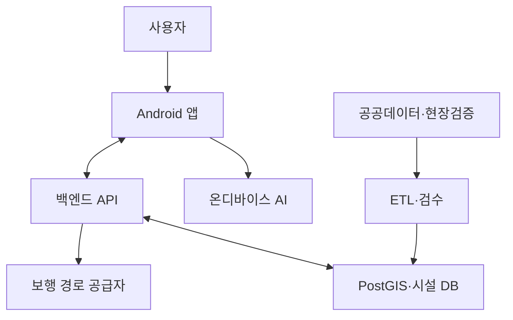
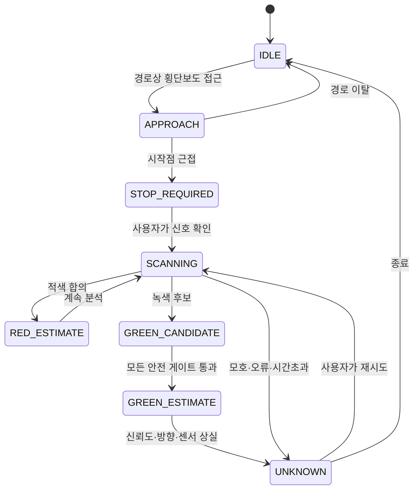

# SRD — Software Requirements Document

> 시스템: Safe Cross KR  
> 버전: 0.2
> 기준일: 2026-09-04  
> 요구 표현: `shall`에 해당하는 “해야 한다”는 검증 필수 요구사항이다.

## 1. 범위

본 SRD는 Android 앱, 백엔드 API, 공공데이터 적재 파이프라인, 운영자 기능, 온디바이스 보행자 신호 추정 모듈의 요구사항을 정의한다. 학습 연구용 도구는 운영 시스템과 분리하지만 모델 산출물의 재현성·서명·평가 요구를 포함한다.

## 2. 용어

| 용어 | 정의 |
|---|---|
| 횡단보도(crossing) | 보행자가 도로를 횡단하는 공간 객체 |
| 시설 데이터 | 신호등, 음향신호기, 점자블록, 턱낮춤 등의 정적 속성 |
| SPaT | Signal Phase and Timing, 실시간 또는 준실시간 신호 현시·잔여시간 정보 |
| TLCA | Traffic Light Change Alarm, 카메라로 정차 중 신호 변화를 감지하는 보조 방식 |
| 보행 신호 추정 | 카메라 이미지로 보행자 신호의 상태를 RED/GREEN_ESTIMATE/UNKNOWN으로 분류 |
| 횡단 문맥 | 횡단보도 영역·시작점·진행방향·연결 보행신호를 묶은 검증 정보 |
| 목표 신호 연결 | 화면의 신호 후보 중 현재 횡단 방향에 해당하는 보행신호를 고유하게 선택하는 과정 |
| 공식 실시간 신호 | 한국도로교통공단·지자체 등 승인된 공급자가 제공하는 교차로·방향별 동적 신호정보 |
| false green | 실제 적색·점멸·모호 상태인데 시스템이 녹색으로 알린 안전 중대 오류 |
| ODD | 기능의 성능이 검증된 운용설계영역 |
| 현장 검증 | 승인된 조사자가 위치·방향·시설을 실제 현장에서 확인한 상태 |
| shadow mode | 결과를 사용자 행동 안내에 쓰지 않고 평가용으로만 수집하는 모드 |
| fail-safe | 센서·모델·데이터에 문제가 있으면 UNKNOWN 또는 정지 안내로 축소되는 동작 |

## 3. 시스템 경계



운영 앱 카메라 프레임은 `Android 앱 → 온디바이스 AI` 경계를 벗어나면 안 된다.

## 4. 기능 요구사항

### 4.1 온보딩과 권한

| ID | 요구사항 | 우선순위 | 검증 |
|---|---|---:|---|
| SR-F-001 | 앱은 첫 실행 시 제품의 보조적 성격과 한계를 음성 및 텍스트로 설명해야 한다. | P0 | UI/수동 |
| SR-F-002 | 위치·카메라 권한은 기능을 사용하기 직전에 각각 별도로 요청해야 한다. | P0 | UI 테스트 |
| SR-F-003 | 권한 설명은 수집 목적, 사용 시점, 저장·전송 여부를 포함해야 한다. | P0 | 문구 검사 |
| SR-F-004 | 카메라 권한 거부 시 일반 경로·시설 안내는 계속 제공해야 한다. | P0 | 통합 테스트 |
| SR-F-005 | 정밀 위치가 없으면 횡단보도 정밀 접근 및 신호 추정을 비활성화하고 이유를 알려야 한다. | P0 | 통합 테스트 |
| SR-F-006 | 앱은 안전 문구와 TTS·진동을 사용자가 시험할 수 있는 튜토리얼을 제공해야 한다. | P1 | 수동 |

### 4.2 목적지와 경로

| ID | 요구사항 | 우선순위 | 검증 |
|---|---|---:|---|
| SR-F-010 | 사용자는 텍스트, 음성, 즐겨찾기로 목적지를 설정할 수 있어야 한다. | P0 | UI/E2E |
| SR-F-011 | 앱은 경로 요청 전 출발·도착 후보를 음성으로 확인해야 한다. | P0 | E2E |
| SR-F-012 | 경로 응답은 거리, 예상 시간, 계단 제외 옵션, 데이터 공급자를 포함해야 한다. | P0 | 계약 테스트 |
| SR-F-013 | 앱은 경로 선에서 벗어났음을 감지하고 재탐색 전 사용자에게 알려야 한다. | P0 | 위치 재생 테스트 |
| SR-F-014 | 재탐색 실패 시 마지막 유효 경로와 네트워크 상태를 구분해 알려야 한다. | P1 | 장애 테스트 |
| SR-F-015 | 경로 공급자 API 키는 모바일 앱에 포함하지 않고 백엔드에서 보관해야 한다. | P0 | 바이너리/코드 검사 |
| SR-F-016 | 앱은 사용자가 검색하거나 선택한 최근 목적지(최대 20건) 및 즐겨찾기(⭐)를 기기 로컬에 영구 저장하고 앱 재실행 시 우선순위에 따라 복원 표출해야 한다. | P0 | 단위/UI 테스트 |
| SR-F-017 | 앱은 Android 12+ Fused Location Provider를 연동하고 단조 시계-절대 시계 불일치를 자동 보정하여 야외 고정밀 위치를 안정 수신해야 한다. | P0 | 단위/통합 테스트 |
| SR-F-018 | 앱은 횡단보도 18m 접근 또는 보행 속도 1.2m/s 이하 시 방위각 허용 오차를 110도로 완화하여 연석 정지/서행 중 횡단보도 이탈 판정을 방지해야 한다. | P0 | 알고리즘 테스트 |
| SR-F-019 | 앱은 지각 프레임 텔레메트리를 최대 300프레임 무잠금 원형 버퍼에 로깅하고 이상 현상 감지 시 로컬에 진단 덤프 파일로 플러시할 수 있어야 하며, 원본 이미지나 정밀 좌표는 저장하지 않아야 한다. | P0 | 보안/진단 테스트 |

### 4.3 시설 데이터

| ID | 요구사항 | 우선순위 | 검증 |
|---|---|---:|---|
| SR-F-020 | 백엔드는 위치 반경 또는 경로 회랑(corridor) 내 횡단보도와 신호등을 반환해야 한다. | P0 | API 테스트 |
| SR-F-021 | 시설 응답은 원천 ID, 제공기관, 기준일, 적재일, 현장검증일, 품질상태를 포함해야 한다. | P0 | 스키마 테스트 |
| SR-F-022 | `미기재`, `N`, `없음`을 같은 값으로 취급하지 않고 null/false를 구분해야 한다. | P0 | ETL 테스트 |
| SR-F-023 | 앱은 출처가 오래되거나 미검증이면 확정 표현 대신 “공공데이터상”이라고 안내해야 한다. | P0 | 문구 테스트 |
| SR-F-024 | 좌표가 대한민국 범위를 벗어나거나 위·경도가 뒤바뀐 레코드는 공개 데이터셋에 반영하지 않아야 한다. | P0 | 데이터 품질 테스트 |
| SR-F-025 | 서로 다른 횡단 방향의 시설을 거리만으로 자동 병합하지 않아야 한다. | P0 | ETL 회귀 테스트 |
| SR-F-026 | 동일 출처·원천 ID의 새 기준일 데이터가 들어오면 변경 이력을 보존해야 한다. | P1 | DB 테스트 |
| SR-F-027 | 원천 레코드는 해시와 원본 JSON/CSV 행을 보존해 재현할 수 있어야 한다. | P1 | 감사 테스트 |
| SR-F-028 | 파일럿 횡단보도는 시작점·끝점·진행방위와 방향별 보행신호 연결정보를 별도 엔터티로 관리해야 한다. | P0 | 스키마/현장 검수 |
| SR-F-029 | 자동 공간조인 결과만으로 목표 보행신호 연결을 승인하지 않아야 한다. | P0 | 데이터 발행 테스트 |

### 4.4 접근 알림

| ID | 요구사항 | 우선순위 | 검증 |
|---|---|---:|---|
| SR-F-030 | 앱은 경로상의 현장 검증 횡단보도에 대해 적응형 거리 임계로 사전 알림해야 한다. | P0 | 위치 재생 테스트 |
| SR-F-031 | GPS 정확도 반경이 설정값보다 크면 정확한 거리·방향 표현을 중지해야 한다. | P0 | 센서 모의 테스트 |
| SR-F-032 | 같은 시설 알림은 이동 방향과 쿨다운을 적용해 반복 폭주하지 않아야 한다. | P0 | 단위 테스트 |
| SR-F-033 | 음향신호기, 점자블록, 턱낮춤 상태는 원천값과 현장 검증값을 구분해 안내해야 한다. | P1 | UI/API 테스트 |
| SR-F-034 | 사용자가 “다시 듣기”로 마지막 안내와 출처 기준일을 들을 수 있어야 한다. | P1 | 접근성 테스트 |
| SR-F-035 | TMAP 보행자 API(계단 제외 `searchOption=30`)를 연동하고, 턱낮춤·점자블록·음향신호기 미보장 면책 배너(`DisclaimerBanner`)와 음성 낭독 및 명시적 사용자 확인을 거쳐야 한다. | P0 | UI/접근성 테스트 |
| SR-F-036 | 실시간 보행은 4단계 상태머신(`WalkingMode`: IDLE, WALKING, APPROACHING_CROSSING, CROSSING)을 기반으로 단계별 안전 지침과 고대비 뱃지를 제공해야 한다. | P0 | 상태기계 테스트 |
| SR-F-037 | 화면 상단에 GPS 수신 강도(%) 및 오차 반경(±m) 뱃지를 상시 노출하고 TalkBack 낭독을 지원해야 한다. | P0 | UI/접근성 테스트 |
| SR-F-038 | 화면 꺼짐/백그라운드 전환 시에도 위치 수신과 음성 안내를 유지하는 Foreground Service(`NavigationForegroundService`)를 제공해야 한다. | P0 | 수명주기 테스트 |

### 4.5 카메라와 온디바이스 AI

| ID | 요구사항 | 우선순위 | 검증 |
|---|---|---:|---|
| SR-F-040 | 신호 확인은 사용자 명시 동작 후에만 카메라를 활성화해야 한다. | P0 | UI/권한 테스트 |
| SR-F-041 | 운영 앱은 프레임을 파일·로그·분석 SDK·네트워크에 기록하지 않아야 한다. | P0 | 네트워크/저장소 검사 |
| SR-F-042 | 원시 모델은 최소 RED, GREEN, UNKNOWN 관측을 출력하며 GREEN_ESTIMATE는 안전 상태기계만 생성해야 한다. | P0 | 모델 계약 테스트 |
| SR-F-043 | 모델에 없는·점멸·가려짐·복수 신호·낮은 조도·역광은 가능한 한 UNKNOWN으로 흡수해야 한다. | P0 | 골든셋 테스트 |
| SR-F-043a | 차량용 신호등(가로 횡형 배열, 종횡비 W/H > 1.35) 및 황색/주황색 불빛은 보행자 신호 분석에서 사전 배제해야 한다. | P0 | 단위 테스트 |
| SR-F-043b | 온디바이스 카메라 비전 추정기(CameraVisionSignalEstimator)는 RGB→HSV 고속 공간 변환을 적용하여 명도(V)와 색조(H)/채도(S)를 분리하고, 직사광선/역광(백화) 및 그늘/야간(저조도) 환경에서 적응형 임계값 보정을 수행해야 한다. | P0 | 단위/골든셋 테스트 |
| SR-F-043c | 한국 경찰청 보행신호등 표준 규격에 따라 고채도 적색(Hue 0°~15°, 345°~360°)과 에메랄드/청록색 Green(Hue 145°~195°) 광원을 정밀 세그멘테이션하고, 황색등 및 가로등(Hue 25°~55°)을 명시적으로 차단해야 한다. | P0 | 단위/스펙트럼 테스트 |
| SR-F-043d | 세로 2구 보행신호등 기하 구조를 분석하여 상단 적색(정지인형) / 하단 녹색(보행인형)의 공간 일관성을 검증하고, 단일 점광원 및 상충 시 Red 우선(Zero False-Green) 원칙을 적용해야 한다. | P0 | 기하/시나리오 테스트 |
| SR-F-043e | 2단계 하이브리드 파이프라인(TwoTierHybridSignalEstimator)을 통해 Tier 1(LiteRT 딥러닝 객체 검출)이 보행신호등 바운딩 박스를 검출하지 못한 경우, 배경에 녹색이 존재하더라도 카메라 HSV 단독 GREEN 판정을 절대 금지하고 즉시 UNKNOWN으로 강등해야 한다. | P0 | 하이브리드/안전 테스트 |
| SR-F-044 | 앱은 단일 프레임의 GREEN 결과를 사용자에게 말하지 않아야 한다. | P0 | 상태기계 테스트 |
| SR-F-045 | 녹색 추정은 프레임 합의, 신뢰도, 신호 크기, 방향 정합, GPS 정확도, ODD 품질 조건을 모두 통과해야 한다. | P0 | 속성 기반 테스트 |
| SR-F-046 | 여러 보행자 신호가 있고 목표 방향을 고유하게 결정하지 못하면 UNKNOWN이어야 한다. | P0 | 시나리오 테스트 |
| SR-F-047 | 모델 로드·추론·가속기 오류 시 즉시 UNKNOWN으로 바꾸고 사용자가 이해할 수 있는 오류를 알려야 한다. | P0 | 장애 주입 테스트 |
| SR-F-047a | TfliteModelRunner는 org.tensorflow.lite.Interpreter를 공식 바인딩하여 NPU/NNAPI 및 멀티스레드 CPU 하드웨어 가속 추론을 지원해야 한다. | P0 | 런타임/단위 테스트 |
| SR-F-047b | LocalVlmSignalVerifier는 최근 5프레임의 상태 전이를 추적하는 시간 일관성 롤링 버퍼(녹색 판정 시 최소 60% 안정 프레임 수신)를 통해 단일 프레임 잡음/반사광 오탐을 방지하고 불확실 시 UNKNOWN으로 강등해야 한다. | P0 | 시간축 일관성 테스트 |
| SR-F-047c | LocalVlmSignalVerifier는 프레임 간 Bounding Box IoU가 0.35 미만으로 위치가 급변하거나 물체가 달라진 경우, 시간 일관성 롤링 버퍼를 즉시 초기화(history.clear())하고 신규 Track으로 분리하여 불빛 오합산을 방지해야 한다. | P0 | 공간추적/단위 테스트 |
| SR-F-047d | LocalVlmSignalVerifier는 프레임 간 후보 중심점 이동 변위 속도(v = Δdist / Δt > 0.55 / sec)를 감지하여 횡단보도를 가로지르는 고속 이동 차량/버스를 REJECTED_DYNAMIC_MOTION으로 즉시 UNKNOWN 기각해야 한다. | P0 | 모션필터/단위 테스트 |
| SR-F-047e | CameraVisionSignalEstimator는 발광 램프 외곽 마진 테두리(Collar Band)의 명도(V_collar)와 발광부(V_lamp) 대비를 분석하여, 검은색 하우징 케이스가 없는(V_collar >= 0.45 및 대비 < 0.20) 전광판/간판/유리창 조명을 비신호등으로 기각해야 한다. | P0 | 콘트라스트/단위 테스트 |
| SR-F-048 | 앱은 “안전합니다” 또는 “건너세요”를 출력하지 않아야 한다. | P0 | 정적 문자열/수동 검사 |
| SR-F-049 | 카메라 세션이 종료되면 프레임 버퍼와 분석기를 해제해야 한다. | P0 | 메모리/수명주기 테스트 |
| SR-F-050 | 모델 파일은 해시·서명이 검증된 경우에만 활성화해야 한다. | P0 | 보안 테스트 |
| SR-F-051 | 운영자는 모델 버전을 원격으로 비활성화할 수 있어야 한다. | P0 | kill-switch 훈련 |
| SR-F-052 | 장면 모델은 횡단보도 mask 또는 polygon, 시작점, 진행방향, 신뢰도와 품질을 출력해야 한다. | P0 | 모델 계약/골든셋 |
| SR-F-053 | 목표 신호 선택기는 지도 연결정보, 횡단보도 방향, 기기 방위와 신호 box를 결합해야 한다. | P0 | 기하 시나리오 테스트 |
| SR-F-054 | 횡단보도 문맥이 없고 목표 보행신호를 다른 독립 근거로 고유하게 특정할 수 없으면 녹색 추정을 금지해야 한다. | P0 | 안전 회귀 테스트 |
| SR-F-055 | 정적 공공데이터와 명목 녹색·적색 시간은 공식 실시간 신호 관측으로 변환하면 안 된다. | P0 | 코드/계약 검사 |
| SR-F-056 | 공식 실시간 신호 관측은 승인된 공급자, 교차로 ID, 이동방향 ID, 생성·수신시각, 상태, 잔여시간(제공 시), 품질 플래그를 포함해야 한다. | P1 | 공급자 계약 테스트 |
| SR-F-057 | 공식 실시간 신호는 공급자별 최대 나이와 시계오차를 통과하고 현장 검증된 방향 연결과 일치할 때만 융합해야 한다. | P1 | 시간/매핑 테스트 |
| SR-F-058 | 공식 실시간 신호와 카메라 관측이 충돌하거나 서로 다른 방향을 가리키면 사용자 상태는 UNKNOWN이어야 한다. | P0 | 장애/충돌 테스트 |
| SR-F-059 | 공식 실시간 신호의 미제공·권한 거부·통신 장애는 카메라 결과로 위장하지 않고 공급자 불가 상태로 구분해야 한다. | P1 | 장애 테스트 |

### 4.6 횡단 보조 상태기계

상태는 다음과 같다.



| ID | 요구사항 |
|---|---|
| SR-F-060 | `APPROACH`는 시설 좌표만으로 생성할 수 있지만 신호 상태를 포함하면 안 된다. |
| SR-F-061 | `STOP_REQUIRED`는 사용자가 멈출 준비를 하게 하며 카메라 결과와 무관해야 한다. |
| SR-F-062 | `GREEN_CANDIDATE`는 사용자에게 노출하지 않는 내부 상태여야 한다. |
| SR-F-063 | 필수 입력 하나라도 만료되면 `GREEN_ESTIMATE`에서 즉시 `UNKNOWN`으로 전이해야 한다. |
| SR-F-064 | 전이마다 모델·센서 원문 대신 비식별 사유 코드와 버전만 기록해야 한다. |
| SR-F-065 | 상태기계 파라미터 변경은 앱 코드 또는 서명된 원격설정으로 버전 관리해야 한다. |
| SR-F-066 | 상태기계 입력은 위치, 방위, 횡단 문맥, 목표 신호 연결, 프레임 시퀀스와 선택적 공식 신호를 각각 독립된 관측으로 유지해야 한다. |
| SR-F-067 | 녹색 판정은 가중 평균 점수 하나가 아니라 필수 게이트와 충돌 거부권으로 결정해야 한다. |
| SR-F-068 | 같은 신호 트랙에서 적색 또는 UNKNOWN 뒤 녹색이 연속 확인되어야 하며, 다른 box로 바뀐 전이는 인정하지 않아야 한다. |
| SR-F-069 | 공식 신호·카메라·센서의 timestamp는 monotonic 수신시각 기준으로 정렬하고 만료 관측을 폐기해야 한다. |

### 4.7 음성·진동·TalkBack

| ID | 요구사항 | 우선순위 | 검증 |
|---|---|---:|---|
| SR-F-070 | 시각 정보에만 존재하는 P0 기능이 없어야 한다. | P0 | 수동 |
| SR-F-071 | 모든 조작 요소는 접근성 이름, 역할, 상태, 동작을 제공해야 한다. | P0 | Compose 접근성 테스트 |
| SR-F-072 | 주요 조작의 터치 영역은 64dp 이상, 기타 조작은 최소 48dp여야 한다. | P0 | 스크린샷/레이아웃 테스트 |
| SR-F-073 | RED, GREEN_ESTIMATE, UNKNOWN 진동 패턴은 구분되며 사용자가 끌 수 있어야 한다. | P1 | 기기 테스트 |
| SR-F-074 | 음성 큐는 안전 메시지를 우선하고 오래된 방향 안내를 폐기해야 한다. | P0 | 단위 테스트 |
| SR-F-075 | TTS 초기화 실패 시 TalkBack 라이브영역 또는 시스템 알림으로 대체해야 한다. | P0 | 장애 테스트 |
| SR-F-076 | 앱은 사용자가 안내 속도, 반복, 진동 강도/사용 여부를 설정하게 해야 한다. | P1 | UI 테스트 |
| SR-F-077 | 방향 분기점 변경 시 즉시 새 지침을 음성 발화(QUEUE_FLUSH)하고 30m/15m 전 사전 알림을 제공해야 한다. | P0 | 단위 테스트 |
| SR-F-078 | 저시력 사용자를 위해 4dp 고대비 노란 테두리, 80dp+ 대형 방향 화살표, 36sp+ 대형 남은 거리 표시기를 제공해야 한다. | P0 | Compose 접근성 테스트 |
| SR-F-079 | 시각장애인 특화 음성 길안내 포맷터(BlindGuidanceFormatter)는 단순 좌/우 대신 상대 각도를 1~12시 시계 방향으로 변환하고, 거리를 성인 평균 보폭(0.65m) 기준 걸음 수로 병기하며, TMAP 원문의 시각 단서(상호명/출구)를 제거해야 한다. | P0 | 단위 테스트 |
| SR-F-079-A | 지자기 회전 센서(ROTATION_VECTOR)로 실시간 나침반 헤딩을 측정하고, 목표 경로와 몸이 정렬(오차 18° 이내)되었을 때 ORIENTATION_ALIGNED 햅틱(톡톡 2회 진동) 및 정대 음성 피드백을 제공해야 한다. | P0 | 단위/기기 테스트 |
| SR-F-079-B | 횡단보도 접근 및 정지 대기 구간(15m/8m) 진입 시 수동 터치 조작 없이 카메라 보행 보조 화면으로 자동 연동(TriggerCrossingAssist)되어야 한다. | P0 | 단위 테스트 |

### 4.8 오프라인과 장애

| ID | 요구사항 | 우선순위 | 검증 |
|---|---|---:|---|
| SR-F-080 | 앱은 최근 사용 지역의 시설 데이터와 활성 경로를 암호화된 로컬 DB에 캐시해야 한다. | P1 | 통합 테스트 |
| SR-F-081 | 인터넷 단절 시 새 경로 생성 불가와 기존 경로 사용 가능 여부를 구분해 알려야 한다. | P0 | 장애 테스트 |
| SR-F-082 | 온디바이스 AI는 네트워크 없이 동작해야 한다. | P0 | 비행기 모드 테스트 |
| SR-F-083 | 데이터가 최대 허용 나이보다 오래되면 시설 속성을 확정적으로 안내하지 않아야 한다. | P0 | 시간 이동 테스트 |
| SR-F-084 | 백엔드·경로 공급자·모델·센서 장애를 서로 다른 오류 코드로 표현해야 한다. | P1 | 계약 테스트 |
| SR-F-085 | 백엔드 프록시 장애 시 TMAP 클라우드 직접 호출 및 로컬 오프라인 경로로 3단계 안전 자동 폴백되어야 한다. | P0 | 장애 테스트 |
| SR-F-086 | 외부 네트워크 환경에서 Android 클라이언트와 백엔드 간 통신을 위해 HTTPS 보안 터널(localtunnel 프록시)을 지원해야 한다. | P0 | 네트워크 연동 테스트 |
| SR-F-087 | SK TMAP 공식 POI 통합검색 및 기기 Geocoder 2차 폴백을 통해 전국의 실제 장소를 실시간 검색할 수 있어야 한다. | P0 | 단위/통합 테스트 |
| SR-F-088 | 목적지 검색 결과에서 현재 GPS 위치 기준 거리(m/km)를 산출하고, 5km 보행 제한 초과 여부를 즉시 안내해야 한다. | P0 | 단위 테스트 |
| SR-F-089 | 대한민국 국토교통부 VWorld 표준 2D 정밀 전자지도 엔진을 탑재하여 골목길과 건물을 한글로 선명히 표출하고, OSM/CartoDB 3중 자동 폴백을 지원해야 한다. | P0 | UI/WebView 테스트 |
| SR-F-089-A | 보행 안내 화면(NavigationScreen)에 실시간 세부 지도 카드를 배치하고, 내 위치 펄스 마커(🔵) 및 경로 이탈(🔴) 시각 피드백을 실시간 제공해야 한다. | P0 | Compose/UI 테스트 |
| SR-F-089-B | TMAP 보행자 API 응답에서 보행로(facilityType 11)를 일반 보행로로 올바르게 해석하여 육교 오안내를 원천 차단해야 한다. | P0 | 단위 테스트 |
| SR-F-089-C | 보행 전진 중 출발점 이탈 오탐에 의한 반복 재탐색 루프를 원천 차단하고 도심 GPS 정확도 필터링 및 4회 이상 연속 이탈 검증을 적용해야 한다. | P0 | 단위/현장 테스트 |
| SR-F-089-D | 지도 뷰어는 보행자 진행방향(Heading-Up)으로 360도 무여백 회전 및 쉐브론 마커를 지원하고, 북쪽 고정 토글을 제공해야 한다. | P1 | UI/WebView 테스트 |
| SR-F-089-E | 실시간 보행 텔레메트리(GPS, 진행거리, CTE, 나침반 정대, 단계전환, 재탐색 사유, 음성 발화)를 기록하는 비행 기록기와 원클릭 공유 기능을 제공해야 한다. | P1 | 단위/E2E 테스트 |
| SR-F-089-F | 고소(Overhead) 차량용 신호등 분리 및 한손 파지 손떨림 적응형 보행 녹색 판정 (ADR-021): 도로 상공($Y_{norm} < 0.22$) 램프와 보도측 보행등($Y_{norm} \ge 0.22$)의 고도 분리, 단일 원형 차량 적색등의 보행신호 오인 배제, 녹색 우세 에너지비($G \ge 2R$) 가중치 적용, 손떨림 변위 허용치 대폭 완화($0.08 \rightarrow 0.18$, 뷰파인더 중심 시 최대 $0.25$), `isJitteredSameDynamicTrack` 계승을 통한 프레임 누적 보존, 단일 프레임 블러 시 완만한 감쇄 및 조준선 락온 디바운싱(8프레임/270ms)·안내 음성 4초 쿨다운을 적용해야 한다. | P0 | 단위/알고리즘/기기 테스트 |
| SR-F-089-G | 진행방향(Heading-Up) 지도 회전 360도 랩어라운드 풍차 회전 차단 및 손떨림 저감 안정화 (ADR-022): Leaflet JS 최단 각도 누적(Unwrap)으로 0°/360° 경계 통과 시 360도 반대 회전 차단, 2.5도 미세 불감대(Deadband) 및 0.20s 트랜지션 적용, 센서 레벨 원형 지수이동평균(Circular EMA Low-Pass, $\alpha = 0.25$) 및 12.5Hz 스로틀링, 보행 속도($\ge 0.8\text{ m/s}$) 연동 GPS Course(65%) + 나침반(35%) 상보 융합을 적용해야 한다. | P0 | 단위/기기/WebView 테스트 |

### 4.9 신고와 운영

| ID | 요구사항 | 우선순위 | 검증 |
|---|---|---:|---|
| SR-F-090 | 사용자는 시설 없음, 고장, 위치 오류, 속성 오류를 신고할 수 있어야 한다. | P1 | E2E |
| SR-F-091 | 신고 시 카메라 사진 첨부는 기본 꺼짐이며 별도 동의를 받아야 한다. | P0 | UI/보안 검사 |
| SR-F-092 | 운영자 승인 전 신고가 공식 시설값을 자동 변경하면 안 된다. | P0 | 권한 테스트 |
| SR-F-093 | 운영자 변경은 행위자, 시간, 이전값, 새값, 근거를 감사 로그에 남겨야 한다. | P0 | 감사 테스트 |
| SR-F-094 | 잘못된 모델/데이터 버전을 지역 단위 또는 전체로 비활성화할 수 있어야 한다. | P0 | 운영 훈련 |
| SR-F-095 | CI 파이프라인에서 금지 문구(`safety_phrase_scanner`), 비밀키 누출(`secret_scanner`), SBOM 생성을 자동 검증하고 릴리즈 리허설 드릴(`rehearsal_drill.py`)을 통과해야 한다. | P0 | CI/스크립트 테스트 |

## 5. 비기능 요구사항

### 5.1 안전과 신뢰성

| ID | 요구사항 |
|---|---|
| SR-NF-001 | 시스템은 false-green을 최우선 위험으로 분류하고 모든 릴리스에서 별도 지표로 보고해야 한다. |
| SR-NF-002 | 안전 기능의 단일 실패 지점이 녹색 추정으로 이어지면 안 된다. |
| SR-NF-003 | 녹색 추정 입력의 최대 나이는 구성값으로 제한하고 만료값을 사용하지 않아야 한다. |
| SR-NF-004 | 앱 프로세스 복구 후 횡단 상태는 IDLE 또는 UNKNOWN에서 시작해야 한다. |
| SR-NF-005 | 모델·데이터·상태기계 버전 조합을 릴리스별로 재현할 수 있어야 한다. |

### 5.2 성능 — 초기 목표

| ID | 지표 | 목표 |
|---|---|---|
| SR-NF-010 | 카메라 프레임→상태 후보 P95 | 승인 기기에서 300ms 이하 |
| SR-NF-011 | 주변 시설 API P95 | 국내망 기준 500ms 이하 |
| SR-NF-012 | 경로 API P95 | 공급자 제외 백엔드 오버헤드 200ms 이하 |
| SR-NF-013 | 카메라 분석 프레임률 | 8~15 FPS, 최신 프레임 우선 |
| SR-NF-014 | 20분 카메라 사용 발열 | OS severe thermal 상태 진입 없음 |
| SR-NF-015 | 크래시 없는 세션 | 99.5% 이상(베타 목표) |

수치는 기기군 벤치마크 후 갱신한다. 성능을 위해 안전 게이트를 제거하면 안 된다.

### 5.3 보안·개인정보

| ID | 요구사항 |
|---|---|
| SR-NF-020 | 모든 외부·내부 API는 TLS를 사용해야 한다. |
| SR-NF-021 | 비밀키를 저장소, APK, 로그, 크래시 리포트에 포함하지 않아야 한다. |
| SR-NF-022 | 위치 원문은 기본 분석 로그에서 제거하고 필요 시 넓은 격자 또는 세션 내 메모리로만 사용해야 한다. |
| SR-NF-023 | 목적지와 이동 이력은 기본적으로 서버에 장기 보관하지 않아야 한다. |
| SR-NF-024 | 카메라 프레임이 네트워크 경계 밖으로 나가지 않음을 자동 시험해야 한다. |
| SR-NF-025 | 모델 배포 매니페스트는 서명, SHA-256, 최소 앱 버전, 롤백 버전을 포함해야 한다. |
| SR-NF-026 | 운영자 API는 역할기반 권한, MFA, 감사 로그를 적용해야 한다. |

### 5.4 접근성·호환성

| ID | 요구사항 |
|---|---|
| SR-NF-030 | Android API 28 이상에서 핵심 경로 기능을 지원해야 한다. |
| SR-NF-031 | 최소 3개 제조사, 저·중·고성능 기기군에서 시험해야 한다. |
| SR-NF-032 | 최신 안정 TalkBack과 글꼴 200% 설정에서 P0 흐름을 시험해야 한다. |
| SR-NF-033 | 화면 회전·다크모드·고대비·배터리 절약 모드에서 안전 상태가 유지돼야 한다. |

### 5.5 관측성

| ID | 요구사항 |
|---|---|
| SR-NF-040 | 로그는 correlation ID, 앱/데이터/모델 버전, 결과 코드, 지연시간만 최소 수집해야 한다. |
| SR-NF-041 | 좌표·목적지·프레임·음성 입력 원문은 기본 관측 데이터에 포함하면 안 된다. |
| SR-NF-042 | false-green 의심 신고, 모델 오류율, 데이터 적재 실패, API SLO 위반 알림을 제공해야 한다. |
| SR-NF-043 | 안전 관련 원격설정 변경은 실시간 알림과 감사 기록을 생성해야 한다. |

## 6. 외부 인터페이스 요구

### 6.1 모바일↔백엔드

| Method | Path | 목적 |
|---|---|---|
| GET | `/v1/crossings/nearby` | 반경 내 시설 조회 |
| GET | `/v1/crossings/corridor` | 경로 주변 시설 조회 |
| POST | `/v1/routes/pedestrian` | 보행 경로 요청·정규화 |
| GET | `/v1/data-manifest` | 지역 데이터 버전·해시 |
| GET | `/v1/model-manifest` | 허용 모델·해시·비활성화 상태 |
| GET | `/v1/crossings/{crossingId}/context` | 시작점·끝점·방위·방향별 보행신호 연결 |
| GET | `/v1/signal-status/{crossingId}` | 승인 지역의 정규화된 실시간 신호; 미지원은 명시적 상태 |
| POST | `/v1/reports` | 시설 오류 신고 |

공통 오류 형태:

```json
{
  "error": {
    "code": "LOCATION_ACCURACY_TOO_LOW",
    "messageKey": "error.location_accuracy_low",
    "retryable": true,
    "correlationId": "opaque-id"
  }
}
```

서버 메시지 문장을 그대로 읽지 않고 앱의 검수된 현지화 문구를 `messageKey`로 선택한다.

### 6.2 모델 인터페이스

입력:

- RGB 또는 YUV에서 변환한 정규화 텐서
- 입력 크기와 색 순서는 모델 메타데이터에서 검증
- 프레임 회전·미러링 정보

출력:

```json
{
  "crosswalk": {
    "detected": true,
    "score": 0.93,
    "polygon": [[0.12, 0.72], [0.89, 0.70], [0.64, 0.32]],
    "directionDegrees": 84,
    "entranceDetected": true
  },
  "detections": [
    {
      "class": "PEDESTRIAN_SIGNAL_GREEN",
      "score": 0.91,
      "box": [0.61, 0.08, 0.71, 0.29]
    }
  ],
  "targetAssociation": {
    "signalTrackId": "ephemeral-track-7",
    "score": 0.94,
    "unique": true,
    "reasonCodes": ["MAP_LINK_MATCH", "CROSSWALK_BEARING_MATCH"]
  },
  "quality": {
    "brightness": 0.52,
    "blurScore": 0.12,
    "occluded": false
  }
}
```

모델 점수는 확률 또는 안전 보증으로 표현하지 않는다. 앱은 캘리브레이션된 임계와 상태기계를 별도로 적용한다.

## 7. 데이터 품질 규칙

| ID | 규칙 | 실패 처리 |
|---|---|---|
| DQ-001 | 위도 32~39, 경도 124~132의 기본 범위 | 격리 |
| DQ-002 | 기준일 파싱 가능 | null 표시 + 경고 |
| DQ-003 | 원천 ID 또는 안정적 합성키 존재 | 격리 |
| DQ-004 | Y/N/공란을 true/false/null로 분리 | 적재 실패 |
| DQ-005 | 동일 키 중복은 최신 기준일 우선, 원본 보존 | 이력화 |
| DQ-006 | 횡단보도↔신호등 공간조인 후보가 복수이면 자동 확정 금지 | 검수 큐 |
| DQ-007 | 현장검증값과 공공데이터가 충돌하면 둘 다 보존 | 현장값 우선 표시 + 충돌 플래그 |
| DQ-008 | 행정구역 명칭 변경을 alias 테이블로 관리 | 원천명 보존 |
| DQ-009 | 횡단보도↔보행신호 연결은 진행방향별이며 검수자·근거·현장검증일을 포함 | 미승인 |
| DQ-010 | 공식 실시간 신호는 공급자·교차로·이동방향 코드 매핑과 최대 나이를 명시 | UNKNOWN |
| DQ-011 | 횡단보도 polygon·시작점·끝점이 서로 모순되거나 방향이 미확정 | AI 활성 대상 제외 |

## 8. 시험 요구사항

### 8.1 시험 계층

1. 단위: 거리, 방위, 상태 전이, 임계, 음성 큐, 파서
2. 계약: 외부 API 응답 fixture와 내부 OpenAPI 스키마
3. 통합: PostGIS 공간쿼리, ETL, Android 저장소·서비스
4. 모델: 고정된 독립 골든셋과 기기별 벤치마크
5. 접근성: Compose semantics, Accessibility Scanner, TalkBack 수동
6. 위치 재생: GPX/recorded trace로 접근·이탈·GPS 튐
7. 현장: 승인된 교차로, 안전요원 동행, 사용자는 초기 shadow mode
8. 장애주입: 네트워크, 위치, 카메라, 모델, TTS, 백엔드 중단
9. 융합 비교: 카메라 단독, 카메라+횡단보도, 전체 하이브리드를 같은 시퀀스로 평가

### 8.2 필수 안전 시나리오

| ID | 상황 | 기대 결과 |
|---|---|---|
| ST-001 | 적색 신호가 10초 지속 | RED_ESTIMATE 또는 UNKNOWN, GREEN 금지 |
| ST-002 | 차량 신호는 녹색, 보행자 신호는 적색 | GREEN 금지 |
| ST-003 | 화면에 서로 다른 방향 녹색·적색 동시 존재 | UNKNOWN |
| ST-004 | 신호 일부 가림 | UNKNOWN |
| ST-005 | LED 광고판·상점 불빛 | 보행신호로 선택하지 않음 |
| ST-006 | 강한 역광·렌즈 오염 | UNKNOWN + 카메라 조정 안내 |
| ST-007 | GPS가 반대편 횡단보도로 점프 | 신호 추정 비활성/UNKNOWN |
| ST-008 | 앱이 백그라운드로 이동 | 카메라 중지, 위치는 명시적 내비게이션 서비스 정책대로 |
| ST-009 | 모델 파일 변조 | 모델 로드 거부 + UNKNOWN |
| ST-010 | 서버 kill switch 활성 | GREEN_ESTIMATE 비활성 + 사용자 고지 |
| ST-011 | 횡단보도 도색이 훼손·가림되고 지도 기하도 미검증 | UNKNOWN |
| ST-012 | 공식 신호 GREEN, 카메라 RED 또는 반대 | UNKNOWN, 불일치 사유 |
| ST-013 | 공식 신호가 최대 나이를 초과하거나 생성시각이 역행 | 관측 폐기, GREEN 금지 |
| ST-014 | 다른 신호 box의 RED 뒤 목표 box GREEN | 같은 트랙 전이로 인정하지 않음 |
| ST-015 | 횡단보도 방향과 선택된 신호의 연결 방향 불일치 | UNKNOWN |

## 9. 요구 추적성

각 PR은 다음 템플릿을 채운다.

```markdown
### 요구사항 추적
- PRD: PR-F-006, PR-F-007, PR-F-014~016
- SRD: SR-F-040~069, SR-NF-001~005
- 테스트: ST-001, ST-002, ST-006, ST-011~015
- 데이터/모델 버전: data-YYYYMMDD, model-X.Y.Z
- 접근성 검토: 담당자/일자
- 안전 검토: 담당자/일자
```

## 10. 요구 변경 관리

- P0 안전 요구를 완화하는 변경은 제품책임자, 안전검토자, 접근성 당사자 대표의 승인을 요구한다.
- 임계값은 코드에 흩어 쓰지 않고 버전 관리되는 설정으로 둔다.
- 모델 정확도 개선을 이유로 ODD를 자동 확장하지 않는다.
- 공공데이터 스키마 변경은 raw 적재를 보존한 상태에서 새 parser 버전으로 처리한다.
- 법령·스토어 정책·외부 API 약관은 출시 전 다시 검토하고 검토일을 기록한다.
