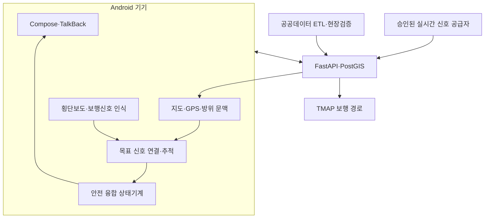
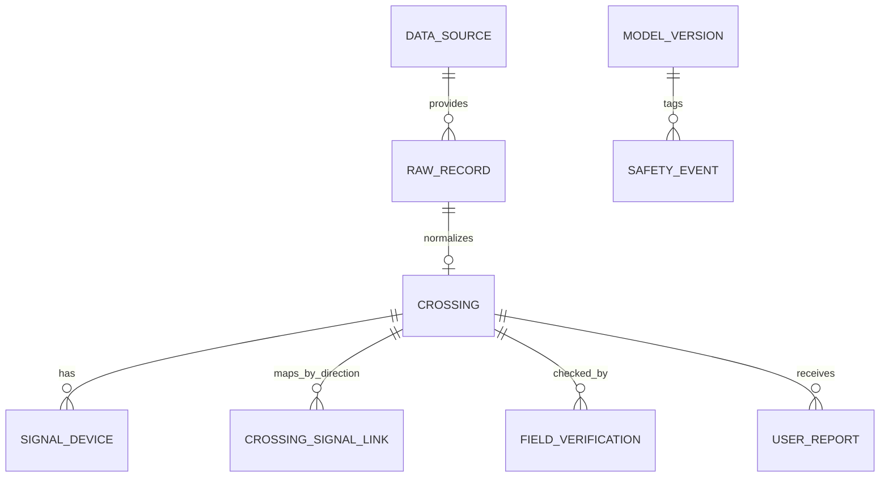
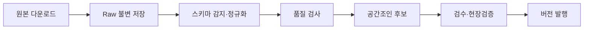

# TRD — Technical Requirements & Design

> 시스템: Safe Cross KR  
> 버전: 0.2
> 기준일: 2026-09-04  
> 아키텍처 상태: Proposed

## 1. 기술 방향 요약

MVP는 Android 네이티브 앱 + 얇은 백엔드 + PostGIS + 별도 ETL + 온디바이스 LiteRT 모델로 구성한다.

| 영역 | 선택 | 이유 |
|---|---|---|
| 모바일 | Kotlin, Jetpack Compose | Android 접근성·카메라·수명주기 직접 제어 |
| 카메라 | CameraX ImageAnalysis | 기기 호환성과 ML 프레임 분석 지원 |
| 온디바이스 ML | LiteRT 2.x 우선, Interpreter fallback | 완전 로컬 추론, CPU/GPU/NPU 선택 가능 |
| 위치 | Fused Location Provider + 센서 방위 | 정확도·배터리 균형, 품질 메타데이터 확보 |
| 로컬 DB | Room + 암호화 검토 | 시설·경로·매니페스트 캐시 |
| 백엔드 | Python 3.12+, FastAPI | 빠른 계약 개발, 데이터/ML 생태계 |
| 공간 DB | PostgreSQL + PostGIS | 반경·회랑·최근접 공간쿼리 |
| ETL | Python, Pandas/Polars, GeoPandas, Alembic | 공공 CSV/API 정규화와 공간검증 |
| 작업 스케줄 | 운영 초기 cron/managed scheduler | 반기/월별 원천 갱신에 충분 |
| 경로 | TMAP 보행자 경로 API 어댑터 | 국내 보행 경로와 계단 제외 옵션 제공 |
| 실시간 신호 | 승인 공급자별 `SignalStatusProvider` 어댑터 | 정적 시설 데이터와 분리, 지역·권한·장애 격리 |
| 관측성 | OpenTelemetry + 비식별 메트릭 | 위치·영상 원문 없이 장애 분석 |

의존성 버전은 구현 시점의 최신 안정판을 공식 문서에서 확인하고 version catalog/lockfile에 고정한다. 문서의 예시 버전을 그대로 최신으로 가정하지 않는다.

## 2. 논리 아키텍처



안전 경계:

- 원시 프레임은 `CameraX → VISION`의 기기 메모리 파이프라인만 통과한다.
- 백엔드는 모델의 개별 프레임 결과를 받을 필요가 없다.
- 서버는 모델 허용 버전과 kill switch만 제공한다.
- 모바일이 서버에 보내는 위치는 경로/주변시설 요청에 필요한 순간값으로 제한한다.
- 정적 시설 데이터와 동적 신호 관측은 타입·테이블·API를 분리한다.
- 공식 신호와 카메라가 충돌하면 어느 쪽 점수가 높더라도 `UNKNOWN`으로 축소한다.

## 3. 저장소와 모듈

```text
safe-cross-kr/
├─ android-app/
│  ├─ app/
│  ├─ core-accessibility/
│  ├─ core-location/
│  ├─ core-audio-haptics/
│  ├─ feature-navigation/
│  ├─ feature-crossing-assist/
│  ├─ perception-crosswalk/
│  ├─ perception-signal/
│  ├─ signal-association/
│  ├─ signal-fusion/
│  ├─ data-local/
│  ├─ data-remote/
│  └─ ml-runtime/
├─ backend/
│  ├─ app/api/
│  ├─ app/domain/
│  ├─ app/adapters/routing/
│  ├─ app/adapters/signal_status/
│  ├─ app/repositories/
│  ├─ migrations/
│  └─ tests/
├─ data-pipeline/
│  ├─ sources/
│  ├─ parsers/
│  ├─ quality/
│  ├─ publish/
│  └─ tests/fixtures/
├─ ml/
│  ├─ datasets/
│  ├─ training/
│  ├─ evaluation/
│  ├─ export/
│  └─ model-cards/
├─ infra/
├─ docs/
├─ .env.example
└─ Makefile
```

모바일의 `feature-crossing-assist`는 ML 구현을 직접 알지 않고 다음 인터페이스만 사용한다.

```kotlin
interface CrosswalkSceneEstimator {
    suspend fun estimate(frame: FrameRef): CrosswalkObservation
}

interface PedestrianSignalEstimator {
    suspend fun estimate(frame: FrameRef): List<SignalObservation>
}

interface TargetSignalAssociator {
    fun associate(
        crossing: VerifiedCrossingContext,
        devicePose: DevicePose,
        crosswalk: CrosswalkObservation,
        signals: List<SignalObservation>,
    ): TargetSignalAssociation
}

data class SignalObservation(
    val ephemeralTrackId: String,
    val state: ObservedSignalState,
    val score: Float,
    val box: NormalizedBox,
    val frameTimestampNanos: Long,
    val quality: FrameQuality,
    val modelVersion: String,
)
```

서버의 동적 신호 공급자는 다음 공통 계약으로 격리한다.

```python
class SignalStatusProvider(Protocol):
    async def get_status(
        self, provider_intersection_id: str, movement_id: str
    ) -> NormalizedSignalStatus: ...
```

`NormalizedSignalStatus`는 provider, intersection/movement ID, state, source timestamp, received monotonic timestamp, optional remaining time, quality flags를 포함한다. 미지원·권한 거부·timeout을 RED/GREEN으로 변환하지 않는다.

## 4. 모바일 설계

### 4.1 화면

1. `OnboardingScreen`: 한계, 권한, TTS/진동 시험
2. `DestinationScreen`: 음성·텍스트·즐겨찾기 및 현재 위치 지오코딩 주소 확인
3. `RouteSummaryScreen`: TMAP 보행자 경로 API(`searchOption="30"`, 계단 제외) 연동, `DisclaimerBanner`(턱낮춤·점자블록·음향신호기 미보장 고지 배너), 주의사항 다시 듣기 및 확인 후 보행 안내 시작 버튼(최소 64dp)
4. `NavigationScreen`: 
   - 상단 실시간 GPS 수신 강도(%) 및 오차 반경(±m) 뱃지 (80% 이상 녹색, 60~79% 청색, 40~59% 주황, 40% 미만 적색)
   - 4단계 보행 모드 상태 배지 (`WalkingModeStatusBadge`: IDLE, WALKING, APPROACHING_CROSSING, CROSSING)
   - 저시력자용 초고대비 대형 방향 안내 표시기 (`LowVisionDirectionIndicator`: 84dp 심볼, 38sp 대형 거리, 24sp 행동 라벨, 4dp 형광노랑 테두리)
   - 분기점 즉시 음성 안내(`QUEUE_FLUSH`) 및 30m/15m 접근 사전 안내
   - 다시 듣기, 카메라 횡단보조 전환, 보행 안내 즉시 종료
5. `CrossingAssistScreen`: 카메라 방향 조정, 실시간 비전 신호등 추정(차량용 신호 및 황색 차단), 추정 상태, 즉시 종료
6. `ReportScreen`: 시설 오류 유형, 선택적 메모
7. `SettingsScreen`: 음성 속도, 진동, 고대비, 개인정보

지도는 보조 시각화다. 어떤 핵심 동작도 지도의 핀을 직접 눌러야만 실행되면 안 된다.

### 4.2 위치 및 백그라운드 서비스 수명주기

- 사용자가 내비게이션을 시작한 동안에만 `NavigationForegroundService`(`foregroundServiceType="location"`)를 실행한다.
- 화면 꺼짐 또는 백그라운드 전환 시에도 지속적인 위치 샘플 수신, 경로 진행 엔진 갱신, TTS 음성 안내를 유지한다.
- 지속 내비게이션은 상태바의 명확한 알림(남은 거리 및 현재 지침 실시간 표시)과 원클릭 '보행 안내 종료' PendingIntent 액션을 제공한다.
- 정밀 위치 권한이 없으면 일반 검색은 허용하되 횡단 정밀 안내를 중지한다.
- 각 위치 샘플은 `lat/lon`, `accuracyMeters`, `bearingDegrees`, `speedMps`, `elapsedRealtimeNanos`, `isMock`를 다룬다.
- 안전 판정은 wall clock이 아니라 monotonic elapsed time(`elapsedRealtimeNanos`)을 사용해 샘플 신선도를 계산한다.

초기 품질 게이트 예시:

```kotlin
fun isLocationUsable(location: LocationSample): Boolean =
    location.accuracyMeters <= config.maxAccuracyMeters &&
    nowElapsedNanos() - location.elapsedRealtimeNanos <= config.maxLocationAgeNanos &&
    !location.isMock
```

모의 위치는 개발·시험 빌드에서는 허용하고 운영 빌드의 안전 추정에서는 차단 또는 명확히 표시한다.

### 4.3 경로 탐색 및 TMAP 어댑터

- TMAP 보행자 경로 API 연동 규약:
  - 엔드포인트: `https://apis.openapi.sk.com/tmap/routes/pedestrian?version=1`
  - 요청 파라미터: `startX/startY`, `endX/endY`, `startName/endName`, `reqCoordType="WGS84GEO"`, `resCoordType="WGS84GEO"`, `searchOption="30"`(계단 제외 옵션)
  - GeoJSON 응답 정규화:
    - Feature Point: `Maneuver` (index, pointIndex, location, instruction, turnType, facilityType)
    - Feature LineString: `RouteSegment` (index, name, distanceMeters, durationSeconds, geometry, facilityType)
- 접근성 한계 면책 고지 배너 (`DisclaimerBanner`):
  - TMAP 보행자 경로는 계단을 우회하지만 보도 턱낮춤(2cm 이하), 점자블록, 음향신호기 완벽성을 일체 보장하지 않음을 글꼴 200% 확대 상태에서도 줄임표 없이 고정 노출하고, 진입 즉시 TTS로 전문 낭독한다.

1. 경로 선에 현재 위치를 투영한다.
2. 전방 route progress 구간의 횡단보도만 후보로 남긴다.
3. 횡단보도까지의 직선거리와 경로상 거리를 모두 계산한다.
4. GPS 정확도와 이동속도에 따라 알림 반경을 조정한다.
5. 같은 원천 ID + 접근 방향은 쿨다운한다.
6. 반대편·평행 도로 후보가 복수이면 교차로 일반 접근 알림만 하고 정확한 방향은 말하지 않는다.

초기 임시값:

- 사전 알림: 경로상 40m
- 정지 준비: 15m
- 사용자 요청 카메라 활성: 거리와 무관하게 가능하되, 조건 미충족 시 상태는 UNKNOWN
- GREEN_ESTIMATE 공개 가능: 시작점까지 경로상 12m 이내 및 GPS accuracy ≤15m
- 후보 캐시 반경: 100m

현장 검증 후 값과 근거를 버전 관리한다.

### 4.4 CameraX 파이프라인

- `Preview`는 저시력 사용자를 위해 선택 제공한다.
- `ImageAnalysis`는 `STRATEGY_KEEP_ONLY_LATEST`로 지연 누적을 방지한다.
- 분석 해상도는 모델 요구와 기기 발열 사이에서 결정한다. 시작점은 640×480 분석, 320/384 정사각 모델 입력이다.
- YUV→RGB, 회전, letterbox 변환 정보를 유지해 box를 원본 좌표로 복원한다.
- `ImageProxy.close()`를 `finally`에서 반드시 호출한다.
- 카메라가 백그라운드로 가면 즉시 unbind한다.
- 프레임 객체에 `toByteArray()` 같은 무분별한 복사를 금지하고 버퍼 재사용을 측정한다.
- 작은 보행신호가 전체 축소 영상에서 사라지지 않도록 전체 장면용 저해상도 입력과 지도·횡단 문맥이 제안한 고해상도 ROI crop을 비교한다.
- 횡단보도 mask와 신호 box는 동일한 원본 프레임 좌표계로 복원해 기하 연결에 사용한다.
- `CameraVisionSignalEstimator` 실시간 비전 필터링 규칙:
  1. **ROI 높이 최적화:** 도로 위 공중에 높이 걸린 차량용 신호등을 배제하기 위해 상단 0~8%를 마스킹하고 보행자 신호등 높이(8%~65%)를 탐색한다.
  2. **황색/주황색 차단:** 차량용 황색 신호등, 가로등, 방향지시등($R \ge 150, G \ge 120, B < 120, |R-G| < 55$)은 보행 신호에 없으므로 적색/녹색 판정에서 즉시 배제한다.
  3. **스펙트럼 정밀화:** 보행자 적색(고휘도 Red, $R > G \times 1.55, R > B \times 1.55, G < 110$) 및 한국형 보행자 청록색 LED($G \ge 115, G > R \times 1.35, (G+B) > R \times 1.9, R < 110$)로 파장을 한정한다.
  4. **가로형 차량 신호등 배제 (Aspect Ratio):** 차량용 3~4구 신호등은 가로로 길게 늘어서 있으므로, 검출 클러스터의 종횡비가 가로로 긴 경우($Width > Height \times 1.35$ 및 $Width \ge 16$) 보행자 신호등에서 즉시 기각한다.

### 4.5 LiteRT 런타임

구현 순서:

1. CPU 기준 경로를 먼저 검증한다.
2. LiteRT 2.x `CompiledModel` 지원 여부를 런타임에서 확인한다.
3. NPU/GPU 자동 선택을 사용하되 결과 일관성과 초기화 실패를 시험한다.
4. 미지원 기기는 Interpreter CPU fallback을 사용한다.
5. 가속기별 수치 차이가 상태 임계 주변에서 GREEN으로 뒤집히지 않는지 골든 테스트한다.

모델 산출물:

```text
ped-signal-X.Y.Z.tflite
labels.json
model-card.md
evaluation.json
manifest.json
manifest.sig
```

`manifest.json` 예:

```json
{
  "modelVersion": "1.2.0",
  "sha256": "hex-placeholder",
  "minAppVersion": "0.4.0",
  "enabledRegions": ["pilot-region"],
  "oddVersion": "odd-1",
  "disabled": false,
  "rollbackModelVersion": "1.1.3"
}
```

### 4.6 횡단보도–보행신호 연결과 시간 추적

색상 분류 전에 현재 횡단 방향에 해당하는 목표 신호를 확정한다.

1. 현장 검증된 `VerifiedCrossingContext`에서 시작점, 끝점, 횡단 bearing, 방향별 신호 ID와 예상 위치를 읽는다.
2. 카메라에서 횡단보도 mask/polygon, 입구, 소실 방향을 추정한다.
3. 보행신호 후보 box를 차량·자전거 신호와 분리해 검출한다.
4. 지도 연결, 횡단보도 bearing, 기기 pose, 신호 box의 상대 위치로 연결 점수를 계산한다.
5. 후보가 하나로 분리되지 않거나 지도 방향과 모순되면 `unique=false`로 반환한다.
6. 선택된 box에 프레임 간 임시 track ID를 부여한다. 서로 다른 track의 RED→GREEN은 상태 전환으로 인정하지 않는다.
7. 공식 실시간 신호가 있으면 같은 crossing/movement에 연결된 신선한 관측만 별도 증거로 추가한다.

초기 연결 점수의 구성요소는 다음과 같지만 하나의 평균 점수만으로 녹색을 허용하지 않는다.

```text
map_link_match
crosswalk_bearing_match
device_heading_match
signal_geometry_match
track_continuity
scene_quality
```

각 핵심 구성요소에는 독립적인 최소 기준과 veto 조건을 둔다. 예를 들어 지도 연결과 영상 방향이 정반대이면 나머지 점수가 높아도 `UNKNOWN`이다.

### 4.7 안전 융합 상태기계

관측치가 곧 사용자 상태가 아니다. `SignalObservation`을 시간창에 모아 `CrossingDecisionEngine`이 판단한다.

필수 게이트:

1. 횡단보도 현장 검증 완료
2. 사용자가 정지점에서 명시적으로 신호 확인 시작
3. 위치 정확도와 신선도 통과
4. 목표 횡단 방향 bearing 존재
5. 하나의 보행자 신호 ROI가 목표 방향과 정합
6. 횡단보도 mask 또는 현장 검증 기하가 카메라·기기 방향과 정합
7. 같은 신호 track에서 여러 연속 프레임의 상태 전환과 녹색 합의
8. 점수 캘리브레이션과 장면 품질 임계 통과
9. 공식 실시간 신호를 사용한다면 공급자·방향·신선도 검증 통과
10. 공식 신호와 카메라 사이에 중대한 충돌 없음
11. 모델·ODD·지역 kill switch 비활성 아님

초기 연구값 예시이며 출시값이 아니다.

```text
window = 1.5 seconds
minimum usable frames = 8
green agreement = 90%
minimum calibrated green score = 0.90
max observation age = 300 ms
official signal max age = provider contract value
```

어떤 값도 ML 팀 단독으로 낮추지 않는다. false-green 위험 검토와 현장 재시험이 필요하다.

융합 정책:

- 정적 시설 속성이나 명목 신호시간은 동적 신호 증거가 아니다.
- `official=GREEN, camera=RED` 또는 반대인 경우 즉시 `UNKNOWN`.
- 공식 신호를 받지 못하면 `PROVIDER_UNAVAILABLE`로 남기며 임의의 상태를 채우지 않는다.
- 카메라만 사용 가능한 교차로도 나머지 모든 문맥 게이트를 통과해야 한다.
- 공식 신호만으로 녹색 음성을 허용할지는 별도 안전 승인 전까지 비활성화한다.

### 4.8 TTS, 진동 및 방향 분기점 안내

- 별도 `GuidanceArbiter`가 우선순위를 관리한다: `SAFETY > CROSSING > ROUTE > INFO`.
- 새 안전 메시지가 나오면 오래된 ROUTE 메시지는 제거한다.
- `DirectionAction`: TMAP `turnType` 코드 및 `instruction` 문구를 분석하여 직진(STRAIGHT), 좌회전(LEFT), 우회전(RIGHT), 완만한 좌회전(SLIGHT_LEFT), 완만한 우회전(SLIGHT_RIGHT), 횡단보도(CROSSWALK), 유턴(UTURN), 도착(DESTINATION) 등 8대 보행 행동으로 표준화한다.
- **방향 분기점 즉시 음성 발화 (Turn Transition):** 위치 추적 엔진에서 `currentManeuverIndex`가 바뀌는 순간, 기존 음성을 플러시(`QUEUE_FLUSH`)하고 새 분기점 지침을 지체 없이 즉각 발화한다.
- **거리별 사전 접근 안내 (Approach Cue):**
  - 다음 분기점 30m 전(18~35m 구간 진입 시): `"{남은거리}미터 앞 {방향}입니다."`
  - 다음 분기점 15m 전(5~18m 구간 진입 시): `"잠시 후 {방향}입니다. 주변을 살피고 보행하세요."`
  - 동일 분기점에서 중복 발화하지 않도록 단계 플래그(`lastApproachStage`)로 관리한다.
- **저시력자 전용 방향 안내 표시기 (`LowVisionDirectionIndicator`):**
  - 4dp 두께의 선명한 형광 노랑(`HighContrastYellow` #FFD600) 테두리와 순수 흑색 배경(#000000)
  - 84dp 초대형 원형 배지 내 56dp 방향 심볼 화살표
  - 38sp ExtraBold 대형 남은 거리 및 24sp 볼드 동작 명칭
  - 스크린리더 TalkBack `contentDescription` 연동
- 진동은 플랫폼의 의미 기반 haptic API를 우선하고 구형 waveform은 필요한 경우만 fallback한다.
- 이어폰 사용 시 AudioFocus를 짧게 얻고 주변음 청취를 방해하지 않도록 완전 차단 대신 ducking을 검토한다.

## 5. 백엔드 설계

### 5.1 API 원칙

- 모바일에 공급자 키를 노출하지 않는다.
- 공급자별 응답을 내부 도메인 모델로 정규화한다.
- 위치 요청 본문과 응답을 기본 로그에 기록하지 않는다.
- API는 한국어 문장 대신 상태·messageKey를 반환한다.
- 모든 목록은 명시적 버전과 기준시각을 포함한다.
- 요청 제한, 타임아웃, circuit breaker, 캐시를 공급자별로 적용한다.

### 5.2 OpenAPI 계약 예시

`GET /v1/crossings/nearby?lat=35.15&lon=126.85&radiusM=100`

```json
{
  "dataVersion": "kr-crossing-20260904.1",
  "generatedAt": "2026-09-04T06:00:00Z",
  "items": [
    {
      "id": "uuid",
      "location": {"lat": 35.15, "lon": 126.85},
      "pedestrianSignal": true,
      "acousticSignal": null,
      "tactilePaving": true,
      "curbCut": true,
      "source": {
        "provider": "local-government",
        "sourceRecordId": "opaque",
        "referenceDate": "2026-06-30",
        "ingestedAt": "2026-09-04T05:00:00Z"
      },
      "verification": {
        "status": "FIELD_VERIFIED",
        "verifiedAt": "2026-08-20T00:00:00Z"
      }
    }
  ]
}
```

`null`은 원천 미기재, `false`는 명시적 없음이다.

### 5.3 공간 쿼리

반경 조회:

```sql
SELECT *
FROM crossing
WHERE published = TRUE
  AND ST_DWithin(
    geom::geography,
    ST_SetSRID(ST_MakePoint(:lon, :lat), 4326)::geography,
    :radius_m
  );
```

경로 회랑 조회는 GeoJSON LineString을 받아 `ST_Buffer(geography, corridor_m)` 또는 적절한 geometry 투영으로 처리한다. 사용자가 보낸 전체 경로를 로그에 남기지 않는다.

## 6. 데이터 모델



핵심 테이블:

```sql
CREATE TABLE crossing (
  id uuid PRIMARY KEY,
  source_id text NOT NULL,
  source_record_key text NOT NULL,
  geom geometry(Point, 4326) NOT NULL,
  road_name text,
  pedestrian_signal boolean,
  acoustic_signal boolean,
  tactile_paving boolean,
  curb_cut boolean,
  traffic_island boolean,
  lane_count integer,
  green_seconds integer,
  red_seconds integer,
  direction_bearing_deg numeric,
  data_reference_date date,
  quality_status text NOT NULL,
  field_verified_at timestamptz,
  published boolean NOT NULL DEFAULT false,
  valid_from timestamptz NOT NULL,
  valid_to timestamptz,
  UNIQUE (source_id, source_record_key, valid_from)
);

CREATE INDEX crossing_geom_gix ON crossing USING gist (geom);

CREATE TABLE crossing_signal_link (
  id uuid PRIMARY KEY,
  crossing_id uuid NOT NULL REFERENCES crossing(id),
  approach_bearing_deg numeric NOT NULL,
  signal_device_id uuid NOT NULL,
  provider_intersection_id text,
  provider_movement_id text,
  association_status text NOT NULL,
  evidence_uri text,
  verified_by text,
  verified_at timestamptz,
  UNIQUE (crossing_id, approach_bearing_deg, signal_device_id)
);
```

실제 마이그레이션에서는 enum/check constraint, source foreign key, 감사 열을 추가한다.

실시간 신호 관측은 짧은 TTL 캐시만 사용한다. 사용자 이동 경로와 결합해 장기 보관하지 않으며 원천 payload를 일반 로그에 남기지 않는다.

## 7. 공공데이터 ETL



### 7.1 단계

1. 원천 URL, 내려받은 시각, HTTP 메타정보, 파일 SHA-256을 기록한다.
2. 원본 파일은 수정하지 않고 날짜별 raw 영역에 보존한다.
3. 인코딩은 UTF-8 우선, CP949/EUC-KR을 명시적으로 감지·변환한다.
4. 한글 열 이름을 canonical schema에 매핑한다.
5. Y/N/공란, 날짜, 좌표, 숫자를 엄격 파싱한다.
6. 좌표 범위·행정구역·결측·중복 보고서를 생성한다.
7. 횡단보도와 신호등을 10/20/30m 후보로 공간조인하되 자동 단일화하지 않는다.
8. 각 횡단 방향별 시작점·끝점·bearing과 연결 보행신호 후보를 생성한다.
9. 방향·주소·관리번호·현장자료와 공식 공급자 intersection/movement 코드로 검수한다.
10. 승인된 방향별 `crossing_signal_link`만 AI·실시간 신호 활성 대상에 포함한다.
11. 승인된 레코드만 `published=true` 버전으로 발행한다.
12. 이전 버전과 추가·변경·삭제 diff를 보고한다.

### 7.2 canonical 매핑 예

| 공공데이터 열 | canonical | 타입 |
|---|---|---|
| 위도 | latitude | decimal |
| 경도 | longitude | decimal |
| 횡단보도관리번호 | source_record_key | string |
| 보행자신호등유무 | pedestrian_signal | boolean/null |
| 음향신호기설치여부 | acoustic_signal | boolean/null |
| 시각장애인용음향신호기유무 | acoustic_signal | boolean/null |
| 점자블록유무 | tactile_paving | boolean/null |
| 보도턱낮춤여부 | curb_cut | boolean/null |
| 데이터기준일자 | data_reference_date | date |

## 8. ML 개발

### 8.1 문제 정의

한 모델이 모든 것을 해결한다고 가정하지 않는다. 횡단보도 인식은 신호 색상의 직접 증거가 아니라, 목표 신호를 올바르게 선택하고 카메라 방향을 검증하기 위한 문맥 증거다.

- Stage A: 횡단보도 mask/polygon, 입구와 진행방향 추정
- Stage B: 보행자 신호등 head 탐지
- Stage C: head 상태 분류(RED, GREEN, OFF/FLASHING/UNKNOWN)
- Stage D: 횡단보도·지도·방위 기반 목표 신호 연결
- Stage E: 같은 신호 track의 시간 변화 필터
- Stage F: 선택적 공식 실시간 신호와 앱 안전 상태기계 융합

차량 신호, 자전거 신호, LED 표지, 상점 불빛을 hard negative로 적극 포함한다.

### 8.2 데이터 전략

1. AI Hub 데이터로 일반 신호/소형 객체 pretraining을 검토한다.
2. 차량 시점 데이터만으로 출시하지 않는다.
3. 스마트폰 보행자 높이·각도, 광주 횡단보도, 다양한 Android 카메라로 별도 데이터를 수집한다.
4. 촬영은 안전요원과 연구 동의 절차 하에 수행하며 얼굴·차량번호 비식별화를 적용한다.
5. 교차로 단위로 train/validation/test를 분리해 같은 장소가 누출되지 않게 한다.
6. 시간대·날씨·기기·거리·가림·역광별 slice를 만든다.
7. 안전 평가는 독립 담당자가 동결된 test set으로 수행한다.
8. 횡단보도 도색 훼손, 눈·물웅덩이·그림자·차량 가림, 대각선·점선형 횡단보도를 별도 slice로 구축한다.
9. 같은 장면에 차량·보행자·자전거 신호가 함께 있는 다중 신호 시퀀스를 충분히 확보한다.

권장 라벨:

```text
PEDESTRIAN_SIGNAL_RED
PEDESTRIAN_SIGNAL_GREEN
PEDESTRIAN_SIGNAL_FLASHING_GREEN
PEDESTRIAN_SIGNAL_OFF
VEHICLE_SIGNAL
BICYCLE_SIGNAL
AMBIGUOUS_SIGNAL
HARD_NEGATIVE_LIGHT
CROSSWALK_MASK
CROSSWALK_ENTRANCE
CROSSWALK_DIRECTION
TARGET_SIGNAL_LINK
```

운영 출력에서는 `FLASHING_GREEN`, `OFF`, `AMBIGUOUS`를 UNKNOWN으로 축소한다. 녹색 점멸 잔여시간을 확실히 계산할 수 없는 MVP에서는 시작 권고를 하지 않는다.

### 8.3 모델 후보와 최적화

- 소형 detector: MobileNet-SSD 계열, EfficientDet-Lite, YOLO nano급 중 LiteRT 변환 가능성과 실제 기기 지연으로 선택
- 입력: 320 또는 384, 정수 양자화 INT8 우선 평가
- pruning보다 quantization-aware training 또는 대표 데이터 기반 PTQ를 먼저 비교
- 모델 크기 목표: 15MB 이하(초기)
- RAM 추가 사용 목표: 150MB 이하(초기)
- CPU·GPU·NPU별 수치 및 지연 보고

모델 이름보다 실제 ODD의 false-green 지표가 선택 기준이다.

### 8.4 평가 지표

- pedestrian signal detection mAP50/95
- crosswalk segmentation IoU/Dice와 입구 검출 recall
- 횡단 방향 각도 오차
- 상태별 precision/recall
- green precision과 false-green event rate
- 차량 신호를 보행 신호로 선택한 비율
- 방향별 목표 신호 연결 정확도와 잘못된 track 전환 수
- 공식 신호·카메라 불일치율과 충돌 시 false-green 수
- UNKNOWN rate
- 교차로·기기·조도·날씨 slice
- calibration error(ECE/Brier 등)
- P50/P95 inference latency, 메모리, 온도, 전력

시퀀스 이벤트를 평가할 때 연속 프레임을 독립 표본으로 세지 않는다.

동일한 동결 시퀀스로 다음 ablation을 비교한다.

1. 신호 detector/classifier만 사용
2. 신호 + 횡단보도 문맥
3. 신호 + 횡단보도 + 지도·GPS·방위
4. 3번 + 승인된 공식 실시간 신호

전체 accuracy가 아니라 목표 신호 오선택과 false-green이 단계별로 감소하는지를 확인한다.

## 9. 경로 공급자 어댑터

인터페이스:

```python
class PedestrianRouter(Protocol):
    async def route(self, request: RouteRequest) -> NormalizedRoute: ...
```

TMAP 어댑터는 다음을 처리한다.

- `POST https://apis.openapi.sk.com/tmap/routes/pedestrian?version=1`
- `appKey` 헤더
- WGS84GEO 좌표
- `searchOption=30` 계단 제외 옵션 지원 여부
- 최대 5개 경유지 제한
- 공급자 오류를 내부 오류 코드로 변환
- 요청 타임아웃, 재시도 가능한 오류만 제한 재시도, circuit breaker

TMAP 경로가 “시각장애인에게 안전한 경로”라는 의미는 아니다. MVP는 기본 보행 경로 위에 검증 시설을 표시한다. 음향신호기 우선 경로 최적화는 별도 보행 그래프와 현장 데이터가 쌓인 Phase 2에서 수행한다.

대체 공급자 검토 기준:

- 대한민국 보행 커버리지
- 계단 제외·보도·횡단보도 표현
- 앱 내 지도 표시 약관
- 서버 프록시·캐시 허용 여부
- 가격과 SLA
- 공급자 교체 시 데이터 반환/삭제 조건

## 10. 보안·개인정보 설계

### 10.1 위협 모델 요약

| 위협 | 대응 |
|---|---|
| APK에서 API 키 추출 | 외부 공급자 호출을 백엔드 프록시로 제한 |
| 모델 파일 변조 | 서명 + SHA-256 + 안전 버전 allowlist |
| 위치 로그 노출 | 원문 로깅 금지, 짧은 보존, 집계 격자화 |
| 프레임 유출 | 네트워크 클라이언트와 프레임 타입 분리, DLP/테스트 |
| 운영자 오남용 | RBAC, MFA, 최소권한, 감사로그 |
| 원천 데이터 공급망 변조 | HTTPS, 파일 해시, 스키마·변경량 경보 |
| 잘못된 원격설정 | 서명, 범위 제한, 2인 승인, 롤백 |

### 10.2 데이터 분류

| 데이터 | 기본 보관 | 서버 전송 | 비고 |
|---|---|---|---|
| 카메라 프레임 | 메모리 세션 | 금지 | 연구앱은 별도 동의·분리 |
| 현재 위치 | 세션 | 경로/시설 요청 시 | 로그 금지 |
| 목적지 | 로컬 선택 | 경로 요청 시 | 장기 서버 저장 금지 |
| 즐겨찾기 | 로컬 | 기본 금지 | 계정 동기화는 Phase 2 별도 동의 |
| 안전 상태 코드 | 짧은 기간/집계 | 선택 | 좌표와 분리 |
| 시설 신고 | 검수 기간 | 허용 | 최소 정보, 첨부 기본 없음 |

대한민국 개인정보보호법과 위치정보법상 사업자 지위·신고/등록·동의·보유기간은 서비스 모델에 따라 달라질 수 있으므로 출시 전 전문 검토를 받는다.

## 11. 배포와 운영

### 11.1 환경

- local: Docker Compose, fake router, fixture data
- dev: 합성/비식별 데이터, 개발용 공급자 키
- staging: 운영과 동일 구조, 제한된 파일럿 데이터
- production: 승인된 모델·데이터만

### 11.2 CI 게이트

1. formatting/lint
2. unit tests
3. API schema tests
4. migration dry-run
5. ETL fixture/data-quality tests
6. Android unit/instrumentation tests
7. Compose accessibility checks
8. model golden tests and hash check
9. secret scan, dependency/SBOM scan
10. prohibited safety phrase scan

금지 문구 스캔은 보조 수단이다. 번역 리소스와 TTS 조합 문장을 수동 검토한다.

### 11.3 배포

- 백엔드: rolling 또는 blue/green, DB migration expand→deploy→contract
- 앱: 내부 테스트→비공개 베타→지역 제한 베타→단계적 배포
- 모델: 앱 번들 기본 모델 + 서명된 선택 업데이트, 단계적 활성화
- 데이터: immutable version publish, 앱은 매니페스트 해시 검증 후 원자적 교체

### 11.4 롤백

- 모델 false-green 의심: 즉시 해당 모델 kill switch, 이전 승인 모델 또는 UNKNOWN-only로 전환
- 데이터 오류: 지역 데이터 버전 롤백, 캐시 무효화
- API 장애: 마지막 검증 시설·경로 캐시 사용, 새 경로 불가 고지
- 앱 중대 오류: 스토어 롤백이 느리므로 서버 기능 플래그로 위험 기능 우선 차단

## 12. 운영 대시보드

개인 위치를 보여주는 지도가 아니라 집계·품질 중심으로 만든다.

- 데이터 원천별 최근 성공, 기준일, 행 수, 결측률, 좌표 이상
- 모델 버전별 사용 세션, UNKNOWN 비율, 오류·지연 분포
- false-green 의심 신고와 조사 상태
- 지역·모델 kill switch 상태
- 외부 공급자 오류율·요금 한도
- 앱 버전별 crash/ANR(좌표·프레임 제외)

## 13. ADR(Architecture Decision Record) 초안

### ADR-001 — Android 네이티브 우선

- 결정: Kotlin/Compose로 MVP를 구현한다.
- 이유: CameraX, foreground service, TalkBack semantics, 기기별 ML 가속기 제어가 핵심이다.
- 결과: iOS는 요구 검증 후 Core ML/Vision 기반 별도 클라이언트로 확장한다.

### ADR-002 — 영상은 온디바이스 처리

- 결정: 운영 프레임을 서버에 보내지 않는다.
- 이유: 지연·통신 장애·개인정보 위험 감소.
- 결과: 모델 개선용 연구 수집은 별도 앱·동의·비식별 절차가 필요하다.

### ADR-003 — 녹색은 상태기계 결과

- 결정: 모델 단일 출력은 사용자 메시지가 아니다.
- 이유: 위치·방향·시간·다중 신호 모호성을 함께 다뤄야 한다.
- 결과: 모델과 상태기계를 독립 시험·버전 관리한다.

### ADR-004 — 공공데이터와 현장검증 병존

- 결정: 현장값이 원천값을 덮어쓰지 않고 별도 이력으로 존재한다.
- 이유: 출처 추적, 갱신, 충돌 설명이 필요하다.
- 결과: 표시 우선순위와 충돌 정책을 API가 명시한다.

### ADR-005 — 횡단보도와 목표 신호를 함께 인식

- 결정: 횡단보도 mask·방향을 별도 추정하고 현장 검증 지도 링크와 결합해 목표 보행신호를 선택한다.
- 이유: 색상을 정확히 분류해도 옆 방향 또는 차량 신호를 고르면 false-green이 될 수 있다.
- 결과: crosswalk estimator, signal detector/classifier, associator와 temporal tracker를 독립 시험한다.

### ADR-006 — 공식 실시간 신호는 선택적 독립 증거

- 결정: 승인 공급자별 어댑터로만 받고 정적 공공데이터와 분리한다.
- 이유: 지역·교차로 가용성과 권한이 제한되며 지연·방향 매핑 오류가 존재할 수 있다.
- 결과: 미제공은 명시적 unavailable, 만료·충돌은 UNKNOWN이며 공식 신호 단독 녹색은 별도 승인 전 비활성이다.

## 14. 기술 검증 PoC 순서

1. PostGIS 원천 적재와 횡단보도 정합
2. TMAP 보행자 API 연동 및 계단 제외 옵션
3. 온디바이스 LiteRT 런타임과 계약 검증
4. CameraX 실시간 프레임 파이프라인
5. 횡단보도–신호 연결과 상태기계
6. TalkBack과 접근성 고대비 UI

## 15. 보안 자동화 및 릴리즈 리허설 체계

안전성 및 규제 준수를 위해 CI/CD 파이프라인에 다음 자동화 도구를 의무 탑재한다:

1. **금지 문구 스캐너 (`scripts/security/safety_phrase_scanner.py`):**
   - “안전합니다”, “건너세요”, “차가 없습니다”, “100% 녹색” 등 사용자 오인 유발 위험 문구가 코드 및 리소스에 포함될 경우 빌드 즉시 차단
2. **비밀키 스캐너 (`scripts/security/secret_scanner.py`):**
   - TMAP API Key, 서버 토큰, 개인정보가 APK나 리포지토리에 하드코딩되지 않도록 전수 검사
3. **SBOM 생성기 (`scripts/security/sbom_generator.py`):**
   - 모바일 및 백엔드 의존성 무결성 및 라이선스 추적성 확보
4. **릴리즈 리허설 드릴 (`scripts/release/rehearsal_drill.py`):**
   - `release-manifest.json` 생성, SHA-256 해시 대조, 롤백 훈련(`rollback-drill.md`), Go/No-Go 판정 보고서(`go-no-go-report.md`) 자동 생성 및 검증


1. 전국 횡단보도/신호등 CSV 1회 적재와 광주 필터
2. 한국도로교통공단·광주 담당기관에 공식 실시간 보행신호 계약과 시험 접근 문의
3. 5개 현장 검증 지점의 방향별 횡단보도↔보행신호 링크 구축
4. PostGIS 반경·방향 조회와 Android 위치 재생 접근 알림
5. TalkBack만으로 목적지→경로 시작→종료
6. CameraX 프레임을 dummy crosswalk/signal estimator와 associator에 연결
7. 동결 영상에서 카메라 단독 대비 횡단보도·지도·시간축 융합 ablation
8. 공식 시험 신호가 있으면 지연·방향오류·충돌 장애주입
9. 실제 기기 shadow mode
10. 안전 게이트 검토 후에만 제한된 녹색 추정 음성 활성

PoC 1~9는 실제 사용자에게 횡단 시작 판단을 제공하지 않는다.
