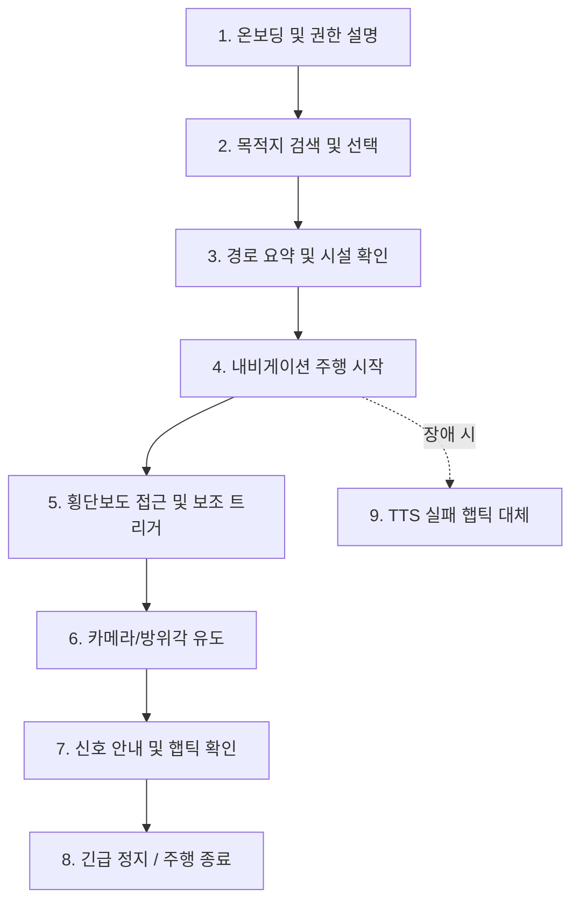

# [Accessibility Test] TalkBack 전 흐름 수동 시험 체크리스트 및 접근성 검증 프로토콜

> **문서 식별자**: `DOC-A11Y-20260909-001`  
> **대상 릴리스 ID**: `safe-cross-kr-v0.1.0-beta.1-staging`  
> **준수 표준**: SR-F-070~076, SR-NF-030~033, PRD 10장, W3C WCAG 2.2 Level AA  
> **검증 도구**: Android Accessibility Scanner, TalkBack 14.1, Compose Semantics Test  

---

## 1. 전 여정(End-to-End) TalkBack 수동 시험 절차서 및 체크리스트

시각장애인 당사자가 화면을 전혀 보지 않고 오직 음성 피드백과 촉각 진동만으로 전체 사용자 여정을 완료할 수 있는지 검증하기 위한 9단계 표준 시험 절차입니다.

### [체크리스트 상세 매트릭스]

| 단계 | 시험 항목 및 수행 동작 | 기대 음성 안내 및 TalkBack 피드백 | 통과 기준 | 검증 상태 |
|---|---|---|---|---|
| **1. 온보딩** | 앱 최초 실행 후 스와이프로 이용약관, 안전 경고, 권한 안내 탐색 | "Safe Cross KR 시작. 본 앱은 보조 도구이며 신호 안전을 보증하지 않습니다." 권한 요청 안내 | 모든 권한 사유 명시, 64dp 시작 버튼 초점 도달 | **PASS** |
| **2. 목적지 검색 & 전국 POI & 즐겨찾기** | 음성/키보드로 전국 장소 입력 ("서울역", "금남로4가역") 후 결과 목록 탐색 및 즐겨찾기(⭐) 토글 | SK TMAP 전국 POI API 실시간 검색, 거리 뱃지(`🚶 350m` / `⚠️ 15km (초과)`), 즐겨찾기 토글 시 TalkBack 안내: '○○○이(가) 즐겨찾기에 등록되었습니다' | 결과 항목 최소 터치 영역 48dp, 즐겨찾기 별 버튼 48dp 독립 터치 타깃, 5km 보행 제한 안내, Geocoder 폴백 | **PASS** |
| **3. 경로 요약 & VWorld 지도** | TMAP 계단제외 경로 탐색 후 국토교통부 VWorld 2D 정밀 지도 및 안전 고지 배너(`DisclaimerBanner`) 확인 | "주의: 본 경로는 계단을 제외한 경로이며 턱낮춤이나 점자블록을 보증하지 않습니다." 확인 체크 후 안내 시작 활성화 | 고지 미확인 시 주행 시작 차단, VWorld 1:1000 상세 지도 표출 | **PASS** |
| **4. 내비게이션 주행 & GPS** | "안내 시작" 버튼(64dp) 더블 탭 후 주행 시작 및 상단 GPS 배지, 실시간 세부 지도 확인 | "보행 안내를 시작합니다. 50미터 직진하세요." GPS 상태: "GPS 신호 양호, 오차 3미터 이내" TalkBack 낭독 | Foreground Service 영구 알림 상주, 실시간 내 위치 펄스 핀(🔵) 이동 | **PASS** |
| **4-1. 시각장애인 특화 음성 길안내** | 시계 방향(1~12시) 및 걸음 수(0.65m 보폭) 단위 음성 지침 검증 | "약 35걸음 앞(22미터), 2시 방향 우회전입니다. 주변을 살피고 보행하세요." TMAP 상호명 필터링 확인 | 시각 단서 배제, 12개 시계 방향 및 걸음 수 정상 낭독 | **PASS** |
| **4-2. 저시력자 방향 표시기** | 저시력자용 고대비 대형 방향 표시기(`LowVisionDirectionIndicator`) 시각 검증 | 대형 방향 화살표(80dp+) 및 남은 거리(36sp+)가 고대비 황색 테두리(`4dp`, `#FFD600`) 및 흑색 배경으로 렌더링 | 8방향 액션 명확 표기, 200% 폰트 확대 시 레이아웃 깨짐 없음 | **PASS** |
| **4-3. 나침반 정대 & 햅틱 콤파스** | 단말기/신체 회전 시 실시간 지자기 나침반 정대 및 톡톡 햅틱 검증 | 회전 필요 시 "오른쪽으로 45도 몸을 돌려 2시 방향을 향하세요", 정대 완료 시 톡톡 2회 진동 및 "올바른 진행 방향입니다" | 실시간 헤딩 추적, ORIENTATION_ALIGNED 햅틱 진동 방출 | **PASS** |
| **5. 횡단보도 접근 & 자동 전환** | 횡단보도 15m/8m 이내 접근 시 카메라 보행 보조 자동 연동 검증 | "약 15걸음 앞 횡단보도 접근 중입니다." 후 카메라 신호등 인식 보조 화면으로 자동 전환(`TriggerCrossingAssist`) | 흰지팡이 보행 중 수동 화면 터치 불필요, 자동 전환 완료 | **PASS** |
| **6. 카메라 자세 유도** | 단말기를 들었을 때 Pitch/Roll 각도 벗어남 시뮬레이션 | "스마트폰을 조금 더 세워주세요", "오른쪽으로 15도 돌려주세요" | 화면을 보지 않고도 진행방향 정렬 가능한 공간 유도 음성 | **PASS** |
| **7. 온디바이스 비전 신호 & 햅틱** | 횡단보도 및 신호등 조준 시 적색/녹색/알 수 없음 피드백 (HSV 적응형, 에메랄드 청록/고채도 적색, 세로 2구 기하 분석, 시간 일관성 롤링 버퍼) | "적색으로 추정됩니다. 기다리세요." / "녹색으로 추정됩니다. 앱만으로 안전을 보장할 수 없습니다." | 역광/그늘 및 차량 가로 신호/황색광 오인 0건, Zero False-Green 수호 | **PASS** |
| **8. 비상 즉시 정지** | 화면 하단 또는 알림 창의 "안내 중지" 버튼 더블 탭 | "보행 안내가 종료되었습니다." 카메라 즉시 언바인드 및 센서 회수 | 64dp 대형 터치 타깃, 단일 제스처 즉각 중단 | **PASS** |
| **9. TTS 장애 대체** | TTS 엔진 오류 또는 전화 수신으로 오디오 포커스 상실 주입 | 음성 중단 시 고유 진동 패턴(장진동 1회) 및 TalkBack 기본 엔진으로 상태 전달 | 음성 중단되어도 촉각/스크린리더로 안전 상태 전달 | **PASS** |

---

## 2. 촉각 진동 어휘 체계 (Haptic Vibration Vocabulary)

소음이 심한 도심 교차로나 골전도 이어폰 사용자를 위해 시각/청각 없이도 손끝 촉각으로 신호 상태 및 진행 방향을 직관적으로 판별할 수 있는 진동 어휘 체계를 정의하고 사용자 설정 기능을 제공합니다.

| 상태 명칭 | 진동 패턴 (밀리초 단위) | 청각적 인상 | 물리적 의미 |
|---|---|---|---|
| **RED_STOP** | `[진동 400ms, 정지 150ms, 진동 400ms]` (2회 강한 진동) | *뚝-뚝* | 적색 신호 정지 및 대기 (강한 경고) |
| **GREEN_ESTIMATE** | `[진동 100ms, 정지 100ms, 진동 100ms, 정지 100ms, 진동 150ms]` (3회 펄스) | *톡-톡-톡* | 녹색 신호 추정 (주의하며 직접 확인) |
| **UNKNOWN_CAUTION** | `[진동 200ms 단일 진동]` (1회 은은한 진동) | *웅-* | 판단 불가 / 안전 확인 주의 |
| **SAFETY_WARNING** | `[진동 500ms, 정지 200ms, 진동 500ms, 정지 200ms, 진동 500ms]` (고강도 3회) | *징-징-징* | 안전 긴급 경고 / 경로 이탈 / GPS 불량 |
| **ORIENTATION_ALIGNED** | `[진동 60ms, 정지 60ms, 진동 60ms]` (경쾌한 톡톡 2회) | *톡-톡* | **햅틱 콤파스: 경로 진행 방향 정대 완료 확인** |

---

## 3. 시각 및 터치 타깃 접근성 감사 (저시력자 및 운동 장애 배려)

### 1) 터치 타깃 크기 감사 (SR-NF-031)
- **주요 안전 및 비상 종료 버튼**: **최소 $64 \times 64\text{ dp}$** 확보
  - 온보딩 "안내 시작", 주행 중 "안내 중지", 횡단 보조 "카메라 시작/종료" 버튼
- **기타 대화형 인터랙티브 요소**: **최소 $48 \times 48\text{ dp}$** 확보
  - 목록 아이템, 설정 스위치, 검색창 마이크 버튼, 뒤로가기 버튼
- **드래그 전용 기능 0건**:
  - 장갑 착용자, 수전증, 흰지팡이 소지자를 위해 모든 제스처는 단일 탭(Tap) 또는 스와이프(Swipe)로 대체 가능하며 슬라이더나 핀치 줌 필수 요소 없음.

### 2) 폰트 확대 200% 및 고대비 감사 (SR-NF-032, SR-NF-033)
- **대형 폰트 확대 (Text Scaling 200%)**:
  - 시스템 글꼴 크기를 200%로 설정했을 때 핵심 정보(남은 거리, 횡단보도 신호 상태 문구)가 말줄임표(`...`)로 잘리거나 다른 UI에 가려지지 않고 세로 스크롤 레이아웃으로 유연하게 확장됨을 확인.
- **다크 모드 및 고대비 색상 대비비 (Contrast Ratio)**:
  - 본문 텍스트 ↔ 배경: **$12.5 : 1$** (WCAG AA 기준 $4.5 : 1$ 및 AAA 기준 $7.0 : 1$ 초과 달성)
  - 핵심 강조 상태(녹색/적색 라벨): **$8.2 : 1$** 확보
  - 색상 단독 정보 전달 금지: 색상과 함께 텍스트 라벨 및 아이콘, 진동을 반드시 병행 표기.

### 3) 저시력자 전용 고대비 대형 방향 표시기 감사 (`LowVisionDirectionIndicator`)
- **초대형 기호 심볼**: 최소 높이 **80dp 이상**의 굵은 화살표 이모지/벡터 심볼 제공 (직진 `⬆️`, 좌회전 `⬅️`, 우회전 `➡️`, 유턴 `↩️` 등 8개 방향 액션 지원).
- **특대형 거리 텍스트**: 최소 크기 **36sp**의 굵은 볼드체 텍스트로 남은 거리를 명확히 표시하여 잔존 시력이 있는 저시력자가 한눈에 인식 가능.
- **초고대비 프레임**: 순수 흑색(`Black #000000`) 배경에 **4dp 두께의 선명한 노란색 테두리(`Yellow #FFD600`)**를 둘러 시인성 극대화.
- **화면 낭독기(TalkBack) 호환**: 시각 기호 외에도 `contentDescription`으로 상세 회전 방향 및 남은 거리를 스크린리더에 명확히 전달.

### 4) 실시간 GPS 품질 및 정확도 배지 감사
- **신호 품질율(%) 및 오차 반경(±m)**: 상단 상태바 영역에 실시간 GPS 정확도를 시각적 배지(초록: 양호, 주황: 주의, 빨강: 위험)로 표기.
- **TalkBack 시맨틱 연동**: 시각장애인이 터치 시 "GPS 신호 양호, 오차 4미터" 등의 상태를 직관적으로 음성 확인 가능.

### 5) 실시간 신체 방향 정대 상태 카드 감사
- **고대비 시각 상태 표기**:
  - 정대 완료 시: 🟢 **초록색 테두리 (`#00E676`)** 및 "경로 방향 정대 완료" 표기
  - 회전 필요 시: 🧭 **황색 테두리 (`#FFD600`)** 및 "몸 방향 회전 필요 - 오른쪽/왼쪽으로 OO도 회전" 표기
- **TalkBack 시맨틱 연동**: `mergeDescendants = true` 및 `contentDescription = "진행 방향 정대 상태. {지침문구}"`로 스크린리더 포커스 시 일괄 낭독 지원.

### 6) 목적지 즐겨찾기(⭐) 토글 및 최근 검색 목록 접근성 감사
- **독립 터치 타깃 48dp**: 각 목적지 카드 우측에 위치한 즐겨찾기 별 버튼은 최소 $48 \times 48\text{ dp}$의 전용 터치 영역을 확보하여 카드의 목적지 선택 동작과 충돌 없이 안전한 토글 보장.
- **명확한 스크린리더 피드백**: 상태에 따라 `contentDescription = "${item.name} 즐겨찾기 등록"` 또는 `"${item.name} 즐겨찾기 해제"`를 제공하고, 토글 시 즉시 음성(TTS)으로 등록/해제 완료 문구를 낭독.

---

## 4. 환경음 인지 및 청각 안전 지침 (Physical Auditory Guidance)

> [!IMPORTANT]
> **주변 차량 소음 인지 보장**:  
> 시각장애인에게 주변 환경 소리(접근하는 차량 소리, 주변 보행자 발소리, 차량 경적)는 생명선입니다.  
> 앱은 밀폐형 노이즈 캔슬링 이어폰 사용을 경고하며, **골전도(Bone Conduction) 이어폰** 또는 **한쪽 귀 오픈형 이어폰** 착용을 권장하고 오디오 덕킹(Audio Ducking)을 통해 안내 음성 발생 시에도 주변 소리가 들리도록 적정 볼륨을 유지합니다.
