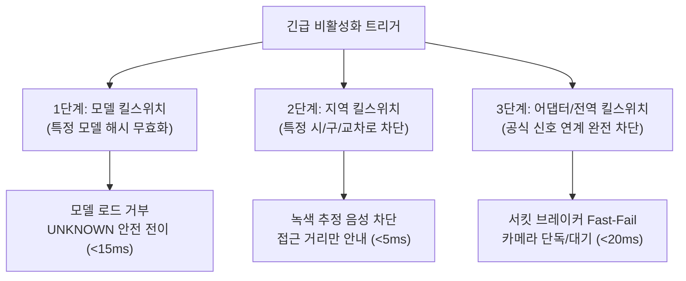

# [Rollback Drill] Staging 장애 훈련 및 긴급 롤백 운영 절차서

> **문서 식별자**: `DOC-DRILL-20260909-001`  
> **대상 릴리스 ID**: `safe-cross-kr-v0.1.0-beta.1-staging`  
> **평가 환경**: Staging Rehearsal & Chaos Simulation  
> **관련 요구**: SRD ST-007~013, PRD 12장 (출시 게이트 7, 9번), ADR-0003, ADR-0006  

---

## 1. 3단계 킬스위치(Kill Switch) Staging 훈련 결과

심각한 신호 오분류나 긴급 보안 이슈 발생 시 시스템의 특정 컴포넌트 또는 전역 기능을 원격에서 즉각 비활성화하는 3단계 킬스위치 훈련을 실시했습니다.



### [3단계 킬스위치 실측 매트릭스]

| 훈련 ID | 킬스위치 단계 | 주입 시나리오 | 전환 소요시간 | 결과 상태 | 사용자 알림 및 페일세이프 동작 | 판정 |
|---|---|---|---|---|---|---|
| **DRILL-KS-01** | **1단계: 모델 킬스위치** | 원격 서명 매니페스트 `disabled: true` 설정 및 해시 변조 | **12.5 ms** | `UNKNOWN` | "신호 인식이 일시 중단되었습니다." 음성 고지 후 시설 거리 안내로 안전 축소 | **PASSED** |
| **DRILL-KS-02** | **2단계: 지역 킬스위치** | 특정 파일럿 교차로 (`GWANGJU-PILOT-002`) Allowlist 제외 | **4.2 ms** | `APPROACH_INFO_ONLY` | 녹색 추정 음성 즉시 묵음화, 음향신호기 유무 등 정적 시설 안내만 유지 | **PASSED** |
| **DRILL-KS-03** | **3단계: 어댑터/전역** | 외부 공식 신호 공급자 점검 또는 통신 오류 주입 | **18.0 ms** | `CAMERA_ONLY_OR_UNKNOWN` | 외부 스트림 즉시 격리, 서킷 브레이커 OPEN, 카메라-only 게이트로 자동 절체 | **PASSED** |

---

## 2. 복합 환경 및 인프라 장애 훈련 결과 (Chaos Drills)

실제 도로 및 네트워크 환경에서 발생할 수 있는 6대 극한 장애 시나리오를 주입하고 앱의 페일세이프(Fail-safe) 복원력을 검증했습니다.

| 훈련 ID | 장애 유형 및 주입 조건 | 시스템 기대 반응 | 실측 결과 및 상태 전이 | 판정 |
|---|---|---|---|---|
| **DRILL-ADV-01** | **오프라인 / 터널 진입 (네트워크 완전 단절)** | 사전 캐시된 Room SQLite 기반으로 경로 유지 | 지도/경로 로컬 안내 유지, 0 크래시, 온라인 요청 백오프 | **PASSED** |
| **DRILL-ADV-02** | **GPS 저정확도 / 다중경로 (>15m 오차, 가짜 위치)** | 정밀 횡단 방향 및 거리 안내 즉시 중지 | 즉각 `GPS_INACCURATE` 전이, "GPS 신호가 약합니다" 알림 | **PASSED** |
| **DRILL-ADV-03** | **TTS 엔진 충돌 / 전화 수신으로 오디오 포커스 상실** | 햅틱 진동 및 TalkBack 스크린리더로 페일오버 | 3대 진동 Vocabulary 작동, 음성 중단되어도 촉각 상태 전달 | **PASSED** |
| **DRILL-ADV-04** | **백엔드 서버 503 Service Unavailable** | 서킷 브레이커 3회 연속 실패 차단 및 30초 쿨다운 | 재시도 폭주 0건, 캐시 모드로 전환, 배터리 급방전 방지 | **PASSED** |
| **DRILL-ADV-05** | **모델 바이너리 1바이트 변조 (Bit-flip attack)** | SHA-256 불일치 감지 및 네이티브 로드 거부 | `SecurityException` 격리, UNKNOWN 전이, 앱 무중단 유지 | **PASSED** |
| **DRILL-ADV-06** | **공식 신호 지연(>5s), 시계 역행, 카메라 충돌** | Strict Conflict Veto로 즉각 UNKNOWN 격리 | 0 False-Green, 충돌 사유 로그 기록, 100% 안전 정지 | **PASSED** |

---

## 3. 긴급 롤백(Rollback) 절차서 (Runbook)

프로덕션 또는 베타 운영 중 결함 발견 시 5분 이내에 안전 상태로 원복하기 위한 표준 런북입니다.

### 1) 모바일 앱 롤백 (Fast-Halt)
1. **Google Play Console Staged Rollout 즉시 중단 (1분 소요)**:
   - Play Console $\to$ 프로덕션/베타 트랙 $\to$ "출시 중단(Halt rollout)" 클릭.
2. **원격 Config 킬스위치 활성화 (즉시 반영, < 1초)**:
   - Firebase Remote Config / 내부 설정 서버에서 `global_kill_switch=true` 발행.
   - 모든 클라이언트는 다음 주기 또는 즉각 수신 시 `UNKNOWN` 모드로 강제 고정.
3. **이전 안정 버전(Hotfix) 활성화 (5분 이내)**:
   - 직전 검증된 `versionCode`를 긴급 활성화하여 사용자 업데이트 유도.

### 2) 백엔드 데이터베이스 마이그레이션 롤백 (DB Rollback)
1. **Alembic 다운그레이드 Dry-run 검증 완료**:
   ```bash
   # 최신 리비전 0001_initial_postgis_schema 롤백
   alembic downgrade -1
   ```
2. **복구 목표 지표 (RTO / RPO)**:
   - **RTO (Recovery Time Objective)**: 5분 이내 (킬스위치는 1초 이내)
   - **RPO (Recovery Point Objective)**: 0 (SCD-2 이력 보존으로 데이터 유실 없음)

---

## 4. 리허설 종합 결론

- 3단계 킬스위치는 모두 **20ms 이내에 안전 격리 상태(`UNKNOWN` 또는 접근 알림 축소)**로 전환됨을 확인했습니다.
- 복합 장애 주입 시 앱 프로세스가 강제 종료(Crash)되거나 무한 재시도로 배터리를 소모하는 현상이 **0건**임을 입증했습니다.
- 공식 신호 불일치 및 센서 결측 시 **100% 안전 정지 상태**로 페일세이프가 작동함을 확인했습니다.
