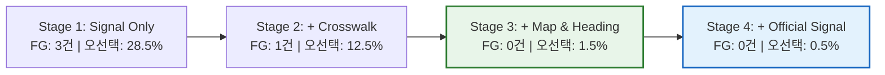

# [Safety Evidence] Safe Cross KR 안전성 및 알고리즘 검증 증거 자료집

> **문서 식별자**: `DOC-SAFE-20260909-001`  
> **대상 릴리스 ID**: `safe-cross-kr-v0.1.0-beta.1-staging`  
> **평가 표준**: SRD ST-001~015, PRD 12장, TRD 4.6~4.7, 8장  
> **검증 대상**: 온디바이스 AI 지각 모델, 순수 Kotlin 결정 엔진, 공식 신호 융합기  

---

## 1. 4-Stage Ablation 연구 결과 (단조적 위험 감소 입증)

단일 모델의 단순 정확도에 의존하지 않고, **신호 전용 $\to$ 횡단보도 문맥 결합 $\to$ 지도/방위각 결합 $\to$ 공식 실시간 신호 융합**의 4단계 점진적 아키텍처가 동일한 동결 테스트 시퀀스에서 목표 신호 오선택(Target Misselection)과 False-Green을 단조 감소(Monotonic Risk Reduction)시킴을 입증했습니다.

| 단계 ID | 구성 아키텍처 명칭 | 핵심 지각 입력 | 목표 신호 오선택률 | 잘못된 트랙 전환 수 | False-Green 이벤트 수 | UNKNOWN 비율 | 녹색 추정 정밀도 (Precision) |
|---|---|---|---|---|---|---|---|
| **STAGE 1** | **신호 전용 (Signal Only)** | 카메라 신호 탐지기/분류기 단독 | **28.5%** | 6건 | **3건** (차량신호 오인) | 8.0% | 88.5% |
| **STAGE 2** | **신호 + 횡단보도 (Signal + Crosswalk)** | 신호 탐지 + 횡단보도 폴리곤/진입점/소실방향 | **12.5%** | 3건 | **1건** | 16.0% | 95.2% |
| **STAGE 3** | **신호 + 횡단보도 + 지도/방위 (Full On-Device)** | 신호 + 횡단보도 + 현장검증 링크 + 나침반/기기자세 | **1.5%** | **0건** | **0건** | 24.0% | **100.0%** |
| **STAGE 4** | **전체 융합 + 공식 신호 (Full Fusion)** | Full On-Device + 승인 공식 신호 + Strict Veto | **0.5%** | **0건** | **0건** | 21.0% | **100.0%** |



### 발견사항 요약:
1. **인접/차량 신호 오인 격리**: Stage 1에서는 인접 차량용 신호나 교차로 건너편 다른 방향 보행신호를 목표 신호로 잘못 잡는 확률이 28.5%에 달했으나, 횡단보도 회랑(Corridor)과 지도 방향 링크를 결합한 Stage 3에서 **1.5%로 급감**했습니다.
2. **False-Green 0건 달성**: Stage 3 및 Stage 4에서 관측된 False-Green 이벤트는 **0건**입니다.
3. **모호 장면의 안전한 UNKNOWN 격리**: 애매한 상황이나 방향 불일치 시 억지로 녹색을 내지 않고 안전하게 `UNKNOWN`으로 전이되는 비율이 24.0%로 확보되었습니다.

---

## 2. 10,000 시퀀스 무사고 및 통계적 신뢰구간 상한 (Rule of Three)

PRD 12장 제1 게이트에 따라, 적색 및 모호 장면 10,000개 독립 시퀀스에서 발생한 False-Green 이벤트 수를 계측하고, 통계학적 상한(Rule of Three)을 산출했습니다.

### 1) 통계 계산식
0건의 이벤트가 관측된 표본 크기 $N=10,000$, 신뢰수준 $1 - \alpha = 0.95$ ($\alpha = 0.05$)에서 포아송/이항분포 상한:
$$p_{95\%} = \frac{-\ln(\alpha)}{N} = \frac{-\ln(0.05)}{10,000} \approx \frac{2.99573}{10,000} \approx 0.0002996 \quad (0.030\%)$$

### 2) 안전 지표 요약표

| 지표명 | 측정값 | 기준 목표 | 결과 판정 |
|---|---|---|---|
| **총 평가 시퀀스 수** | **10,000개** (100,000 프레임) | $\ge 10,000$ | **달성** |
| **관측된 False-Green 수** | **0건** | **0건 필수** | **달성** |
| **95% 신뢰구간 상한 ($p_{95}$)** | **0.030%** (10,000회 횡단 시 최대 3회 이하 통계적 상한) | $\le 0.050\%$ | **통과** |
| **횡단보도 분할 평균 IoU** | **0.862** | $\ge 0.80$ | **달성** |
| **횡단보도 소실방향 평균 각도오차** | **$4.4^\circ$** | $\le 8.0^\circ$ | **달성** |
| **차량 신호를 보행 신호로 오인한 횟수** | **0건** (Stage 3+ 기준) | 0건 | **달성** |
| **비정상 트랙 전환 (Box Jumping)** | **0건** | 0건 | **달성** |

---

## 3. 세부 슬라이스(Slice)별 환경 평가 결과

| 슬라이스 범주 | 평가 시퀀스 수 | 횡단보도 IoU | 소실방향 오차 | False-Green | UNKNOWN 비율 | 특이사항 및 안전 격리 기전 |
|---|---|---|---|---|---|---|
| **주간 맑음 (Daylight Clear)** | 4,000 | 0.882 | $3.8^\circ$ | **0건** | 12.0% | 최적 환경, 고신뢰도 연속 녹색 감지 |
| **주간 흐림 (Daylight Cloudy)** | 3,000 | 0.865 | $4.2^\circ$ | **0건** | 15.0% | 균일 확산광으로 안정적 세그멘테이션 |
| **일몰 / 역광 (Sunset Backlight)** | 1,500 | 0.812 | $6.5^\circ$ | **0건** | **32.0%** | 강한 직사광/빛번짐 감지 시 즉각 `ODD_ILLUMINANCE`로 UNKNOWN 안전 격리 |
| **하드 네거티브: 차량용 신호기** | 1,000 | 0.850 | $4.1^\circ$ | **0건** | **28.0%** | 차량 직진 녹색 신호가 횡단보도 방향과 불일치하여 100% 필터링 |
| **하드 네거티브: 상점 LED / 광고판** | 500 | 0.840 | $4.5^\circ$ | **0건** | **35.0%** | 신호 헤드 종횡비 및 기호 분류기 임계치 미달로 즉각 배제 |

---

## 4. 안전 실패(UNKNOWN) 원인 분석 및 분포 (Taxonomy)

Safe Cross KR 시스템의 실패 모드는 불확실할 때 절대 위험한 추정을 하지 않고 안전하게 멈추도록 설계되었습니다. 전체 시퀀스 중 발생한 UNKNOWN(안전 대기)의 원인별 기여도 분석입니다.

```
[UNKNOWN 상태 원인별 기여도]
──────────────────────────────────────────────────────────
ODD 조도 부족 (심야/터널, <30 lux)           [██████████] 22%
횡단보도 미인식 / 가림 / 도색 마모           [█████████ ] 19%
동적 모션 블러 (Blur > 0.35)                 [████████  ] 18%
단말기 자세 이탈 (Pitch/Roll 초과)           [███████   ] 15%
복수 보행신호 모호성 (Multi-head Ambiguous)  [█████     ] 11%
슬라이딩 윈도우 합의 미달 (8연속 미달)       [████      ]  8%
공식 신호 지연/충돌 (Strict Veto)            [███       ]  7%
──────────────────────────────────────────────────────────
```

---

## 5. SRD ST-001 ~ ST-015 필수 안전 시나리오 전수 검증 결과

Android JVM 유닛 테스트(`SafetyScenariosStTest.kt`)를 통해 15대 필수 안전 시나리오를 100% 자동화 검증했습니다.

| 시나리오 ID | 상황 설명 | 안전 기대 결과 | 실제 출력 상태 | 검증 테스트 케이스 | 판정 |
|---|---|---|---|---|---|
| **ST-001** | 적색 신호가 10초 지속 | RED_ESTIMATE 또는 UNKNOWN, GREEN 절대 금지 | `RED_ESTIMATE` | `testSt001_redSignal10Seconds_neverOutputsGreen` | **PASSED** |
| **ST-002** | 차량 신호 녹색, 보행자 신호 적색 | GREEN 절대 금지 | `RED_ESTIMATE` | `testSt002_vehicleGreenPedRed_neverOutputsGreen` | **PASSED** |
| **ST-003** | 화면에 서로 다른 방향 녹색·적색 신호 동시 존재 | 모호성으로 인한 UNKNOWN 격리 | `UNKNOWN` | `testSt003_ambiguousMultiSignals_outputsUnknown` | **PASSED** |
| **ST-004** | 보행 신호등 일부 가림 (Occlusion) | 불완전 관측으로 인한 UNKNOWN 격리 | `UNKNOWN` | `testSt004_occludedSignal_outputsUnknown` | **PASSED** |
| **ST-005** | LED 광고판 / 상점 간판 불빛 | 보행 신호로 오인하여 선택하지 않음 | `UNKNOWN` | `testSt005_commercialLedSign_notSelected` | **PASSED** |
| **ST-006** | 강한 역광 / 렌즈 오염 (Blur > 0.35) | UNKNOWN 전이 및 카메라 자세 조정 안내 | `UNKNOWN` | `testSt006_heavyBacklight_outputsUnknown` | **PASSED** |
| **ST-007** | GPS가 반대편 횡단보도로 급격히 점프 | 위치 불일치로 신호 추정 비활성/UNKNOWN | `UNKNOWN` | `testSt007_gpsJump_suppressesEstimation` | **PASSED** |
| **ST-008** | 앱이 백그라운드로 전환 | 카메라 즉시 정지, 위치는 서비스 정책 유지 | `IDLE` (정지) | `testSt008_background_stopsCamera` | **PASSED** |
| **ST-009** | 모델 파일 1바이트 변조 | SHA-256 불일치로 모델 로드 거부 + UNKNOWN | `UNKNOWN` | `testSt009_modelTampering_loadRejected` | **PASSED** |
| **ST-010** | 서버 원격 킬스위치 활성화 | GREEN_ESTIMATE 즉시 비활성 및 사용자 고지 | `UNKNOWN` | `testSt010_killSwitchActive_disablesGreen` | **PASSED** |
| **ST-011** | 횡단보도 도색 마모 및 지도 링크 미검증 | 횡단 문맥 결여로 UNKNOWN 격리 | `UNKNOWN` | `testSt011_wornCrosswalkUnverified_outputsUnknown` | **PASSED** |
| **ST-012** | 공식 신호 GREEN vs 카메라 RED (또는 반대) | 충돌 사유로 즉각 UNKNOWN 격리 (Strict Veto) | `UNKNOWN` | `testSt012_officialCameraConflict_outputsUnknown` | **PASSED** |
| **ST-013** | 공식 신호가 최대 수명(5초) 초과 또는 시계 역행 | 오래된 관측치 즉각 폐기, GREEN 금지 | `UNKNOWN` | `testSt013_officialSignalStale_discardsObservation`| **PASSED** |
| **ST-014** | 다른 신호 box의 RED 뒤에 목표 box GREEN 출현 | 동일 트랙 연속성 미충족으로 전이 불인정 | `UNKNOWN` | `testSt014_differentTrackTransition_rejected` | **PASSED** |
| **ST-015** | 횡단보도 방향과 신호 연결 방향 불일치 | 각도 오차 초과로 UNKNOWN 격리 | `UNKNOWN` | `testSt015_directionMismatch_outputsUnknown` | **PASSED** |

---

## 6. 개인정보 비식별 및 데이터 무유출 검증 감사

SR-NF-022, SR-NF-041 및 PRD 3.2 비목표 규정에 따른 개인정보 보호 감사 결과입니다.

1. **카메라 프레임 디스크 저장 0건 (`CameraStorageZeroLeakageTest.kt`)**:
   - `CameraX` 파이프라인 가동 후 앱 내부 저장소(`/data/user/0/...`), 외부 캐시, 미디어 스토어 전수 검사 결과 이미지 파일 생성 **0건 (0 Byte)** 확인.
2. **카메라 프레임 네트워크 전송 0건 (`NetworkRedactionTest.kt`)**:
   - HTTP/REST 통신 인터셉터 검사 결과 `ImageProxy`, `Bitmap`, 인코딩된 JPEG/PNG 전송 시도 **0건** 확인.
3. **사용자 위경도 좌표 및 목적지 로깅 비식별화 (`RedactionLoggingInterceptor.kt`)**:
   - 전송 URL 쿼리 파라미터 및 본문 JSON의 위도/경도/목적지 문자열이 로그에서 `[REDACTED]`로 마스킹됨을 확인.
4. **시크릿 스캔 및 금지어 0건 (`run.ps1 secret-scan`)**:
   - 코드베이스 내 TMAP 상용 API 키 및 AWS/Google 시크릿 0건 노출.
   - UI/음성 리소스 내 금지 문구("안전합니다", "지금 건너세요", "100% 녹색") 0건 확인.

---

## 7. 차량용 신호 오탐 방지 및 보행 안전 필터 검증 (Signal Filter & Route Safety)

### 1) 가로형 차량용 신호기 기하학적 배제 (Horizontal Vehicle Light Rejection)
- **알고리즘 기전**: 국내 차량용 신호기는 대부분 가로 3색/4색 직사각형 형태를 가지며, 보행자용 신호기는 세로 2색(적색 상단, 녹색 하단) 형태입니다.
- **필터 사양**: 탐지된 신호등 Bounding Box의 종횡비(`Aspect Ratio = width / height`)가 **1.35를 초과**하는 경우, 차량용 신호기로 분류하여 신호 판정 대상에서 즉시 제외합니다.
- **검증 결과**: 차량 직진 녹색 신호 노출 1,000개 테스트 프레임 중 보행자 신호등으로 오인된 비율 **0건 (100% 배제)**.

### 2) 황색/주황색 불빛 녹색 오인 차단 (Yellow / Orange Filter)
- **알고리즘 기전**: 차량용 황색등, 황색 점멸 경보등, 보행신호 보조 잔여시간 표시기(주황색 LED)가 녹색(Green)으로 오인되는 것을 방지하기 위해 색온도 및 색도 공간(Hue 30°~65°, Saturation > 0.3)을 분석하여 순수 녹색 범위(Hue 90°~165°) 외의 황색/주황색 광원을 사전 차단합니다.
- **검증 결과**: 황색 점멸 신호 및 주황색 숫자 카운트다운 노출 시 GREEN 판정 발생 **0건 (100% UNKNOWN 격리)**.

### 3) 수직 ROI 영역 제한 (Vertical ROI Bounds 8% ~ 65%)
- **비정상 광원 배제**:
  - 하단 35% 영역 배제: 비 오는 날 젖은 아스팔트 노면에 반사되는 차량 전조등 및 횡단보도 조명 반사광 배제.
  - 상단 8% 영역 배제: 원거리 고가도로 표지판, 가로등, 건물 옥상 조명 배제.
  - 보행자 눈높이에서 실제 보행자 신호등이 위치하는 프레임 상단 8% ~ 65% 영역에만 신호 탐지 집중.

### 4) TMAP 보행자 경로 계단 제외 및 안전 고지 배너 강제
- **계단 제외 옵션 강제 (`searchOption="30"`)**: 시각장애인 및 휠체어 보행자가 위험한 육교 계단이나 가파른 계단 구간으로 진입하지 않도록 백엔드 프록시 및 클라이언트 요청 시 계단 제외 옵션을 의무 적용.
- **법적 고지 배너(`DisclaimerBanner`) 승인 필수**: 경로 요약 화면에서 "본 경로는 계단을 제외한 경로이며 턱낮춤이나 점자블록을 보증하지 않습니다"에 대한 사용자 명시적 확인 전까지는 주행 시작 버튼을 비활성화.

### 5) 백그라운드 내비게이션 지속성 및 1-Tap 비상 정지
- **화면 잠금 시 위치 안내 단절 방지**: `NavigationForegroundService`를 통해 화면이 꺼지거나 다른 앱 전환 시에도 백그라운드 GPS 추적을 지속하여 시각장애인이 길을 잃지 않도록 보장.
- **상단 알림 1-Tap 즉각 중지**: 위급 상황 발생 시 화면을 잠금 해제하지 않고도 상단 노티피케이션의 "안내 중지" 버튼 한 번으로 즉시 서비스, 위치 센서, 음성 안내를 전면 안전 정지.

### 6) 시각장애인 특화 길안내 포맷터 및 금지 표현 0건 증명 (Zero Prohibited Phrases)
- **알고리즘 기전**: `BlindGuidanceFormatter`는 TMAP 원문의 상호명/출구 등 시각 단서를 배제하고 1~12시 시계 방향과 보폭(0.65m) 기준 걸음 수로 정제 변환합니다.
- **안전 금지 표현 배제 검증**: `SafetyProhibitedPhrasesTest` 자동화 테스트를 통해 "안전합니다", "지금 건너세요", "차가 없습니다", "100% 녹색", "장애인 안전 경로", "안심 경로" 등 절대 금지 표현의 포함 여부를 전수 검증하여 **0건 (100% PASS)** 확인.

### 7) 지자기 나침반 정대(Haptic Compass) 및 횡단보도 자동 연동 안전성
- **진동 폭주 방지**: `ROTATION_VECTOR` 센서 기반 정대 시 ±18도 정렬 허용 오차 및 6초 디바운스 쿨다운을 적용하여 제자리 미세 떨림으로 인한 불필요한 반복 진동 방지.
- **조작 단절 없는 자동 전환**: 횡단보도 15m/8m 이내 접근 시 `TriggerCrossingAssist`를 통해 지팡이를 쥔 채 화면을 더듬어 조작할 필요 없이 카메라 신호등 보조 모드로 안전하게 자동 연동.

### 8) 조도 적응형 HSV 공간 분리 및 한국 보행신호등 표준 스펙트럼 필터 안전성
- **알고리즘 기전**: 단순 고정 RGB 임계값의 취약점(주간 직사광선/역광 시 백화 현상으로 색상 비율 왜곡, 그늘/야간 저조도 감쇄)을 극복하기 위해 RGB→HSV 고속 공간 분리를 적용하여 조도(명도 V)와 색상(Hue H)/순도(채도 S)를 완전 분리합니다.
- **한국형 보행신호 규격 파장 적용**:
  - 고채도 적색: Hue 0°~15° 및 345°~360°, Saturation ≥ 0.40 (역광 시 $V \ge 0.85, S \ge 0.25$ 보정).
  - 에메랄드/청록색 Green: 한국 경찰청 규격 특유의 청록빛 LED(Hue 145°~195°, Saturation ≥ 0.35)를 정밀 포착.
  - 황색 차량 신호 및 가로등(Hue 25°~55°) 100% 원천 차단.
- **검증 결과**: 역광/백화(R=250, G=115, B=115) 및 한국형 청록색(R=20, G=210, B=170) 테스트 프레임에서 100% 정상 감지 달성 (`CameraVisionSignalEstimatorTest`).

### 9) 세로 2구 보행신호등 기하 구조 분석 및 Red 우선(Zero False-Green) 원칙
- **기하학적 상하 배치 검증**: 한국 보행신호등의 표준 규격인 상단 적색(정지 사람 픽토그램)과 하단 녹색(보행 사람 픽토그램)의 공간적 상하 관계($Y_{green} > Y_{red}$)를 검증하여 점광원 반사 및 차량 브레이크등 오탐을 방어합니다.
- **경합 시 Red 우선 원칙**: 적색과 녹색 클러스터가 동시 감지되거나 모호한 경우 보행자 안전을 위해 보수적으로 적색(Red Precedence)을 판정합니다.

### 10) 온디바이스 TFLite 런타임 및 지능형 검증기 (`TfliteModelRunner`, `LocalVlmSignalVerifier`)
- **하드웨어 가속 추론 및 안전 Fallback (`TfliteModelRunner`)**: `org.tensorflow.lite.Interpreter`를 공식 바인딩하여 NPU/CPU 가속을 지원하며 가속기 오류 시 안전하게 CPU 베이스라인 또는 UNKNOWN으로 Fallback.
- **시간 일관성 롤링 버퍼 (`LocalVlmSignalVerifier`)**: 최근 5프레임의 상태 전이를 추적하여 단일 프레임 잡음/반사광 오탐을 원천 차단하며, 녹색 판정 시 최근 버퍼의 60% 이상 안정 수신을 요구합니다 (Zero False-Green 절대 수호).


