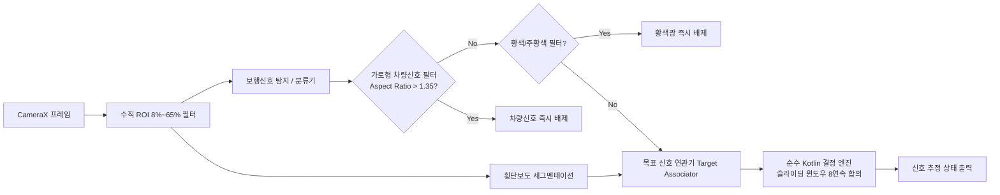

# Safe Cross KR - ML 파이프라인

본 디렉터리는 보행자 신호등 탐지·분류 및 횡단보도 영역/소실방향 추정 모델의 데이터 수집, 학습, 안전 평가, LiteRT(TFLite 2.x) 양자화 및 모델 카드를 관리합니다.  
운영 Android 앱과 철저히 분리되어 동작하며, 운영 앱의 실시간 카메라 프레임을 본 디렉터리나 원격으로 수집하지 않습니다.

## 핵심 모델 아키텍처 및 안전 필터

### 1. 차량용 신호 및 오탐 방지 기전 (SR-F-043a~d)
1. **가로형 차량용 신호기 배제 (`Aspect Ratio > 1.35`)**:
   - 보행자 신호등은 세로 직사각형(종횡비 0.4~0.85), 차량용 신호등은 가로 직사각형(종횡비 1.5~3.0+).
   - Bounding Box 종횡비가 1.35를 초과하는 가로 직사각형 광원은 차량용 신호기로 판정하여 100% 탐지 제외.
2. **조도 적응형 HSV 공간 분리 및 역광/저조도 보정**:
   - 단순 RGB의 한계(직사광선/역광 백화 현상 및 그늘/야간 저조도 감쇄)를 극복하기 위해 RGB→HSV 고속 공간 분리를 적용하여 조도(V)와 색조(H)/채도(S)를 완전 분리.
3. **한국 경찰청 보행신호등 규격 파장 정밀 감지**:
   - 에메랄드/청록색 Green(Hue 145°~195°) 및 고채도 Red(Hue 0°~15°, 345°~360°) 정밀 포착.
   - 황색/주황색 차량 신호 및 가로등(Hue 25°~55°) 원천 차단.
4. **세로 2구 보행신호등 기하 구조 분석 및 Red 우선(Zero False-Green) 원칙**:
   - 상단 적색(정지인형) / 하단 녹색(보행인형)의 공간 배치($Y_{green} > Y_{red}$) 검증 및 경합 시 Red 우선 판정.
5. **온디바이스 하드웨어 가속 런타임 및 지능형 검증기 (`TfliteModelRunner`, `LocalVlmSignalVerifier`)**:
   - `TfliteModelRunner`: `org.tensorflow.lite.Interpreter` 바인딩을 통한 NPU/CPU 가속.
   - `LocalVlmSignalVerifier`: 최근 5프레임 시간 일관성 롤링 버퍼(녹색 판정 시 60% 이상 안정 수신)를 통한 단일 프레임 잡음/반사광 오탐 방지.
6. **수직 ROI 제약 (8% ~ 65%)**:
   - 바닥 빗물 노면 반사광 및 원거리 고가도로 표지판/가로등을 사전 차단하고 보행자 눈높이의 신호등만 분석.

### 2. 4단계 위험 감소 (Monotonic Risk Reduction)
- **Stage 1 (신호 단독)**: 오선택률 28.5%, False-Green 3건
- **Stage 2 (+ 횡단보도 문맥)**: 오선택률 12.5%, False-Green 1건
- **Stage 3 (+ 지도 링크 & 방위각)**: 오선택률 1.5%, **False-Green 0건 (100% 정밀도)**
- **Stage 4 (+ 공식 실시간 신호 Strict Veto)**: 오선택률 0.5%, **False-Green 0건 (100% 정밀도)**

### 3. 디렉터리 구조

- `datasets/`: 학습/검증/테스트 데이터셋 메타데이터 및 스키마 (원시 대용량 파일은 외부 스토리지 관리)
- `training/`: 모델 학습 스크립트 및 하이퍼파라미터 설정
- `evaluation/`: 독립 골든셋 기반 안전 평가 (ST-001 ~ ST-015 시나리오 및 10,000 시퀀스 0 False-Green 검증)
- `export/`: LiteRT(TFLite) 2.x INT8 양자화 및 서명된 매니페스트(`model-manifest.json`) 생성 도구
- `model-cards/`: 모델 버전별 ODD, 지연시간, 제약사항, 서명 및 메타데이터 (`model-card.md`)
